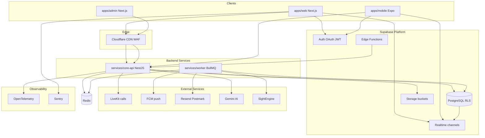
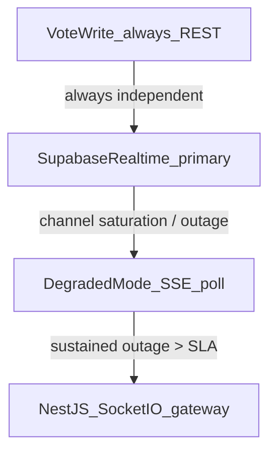
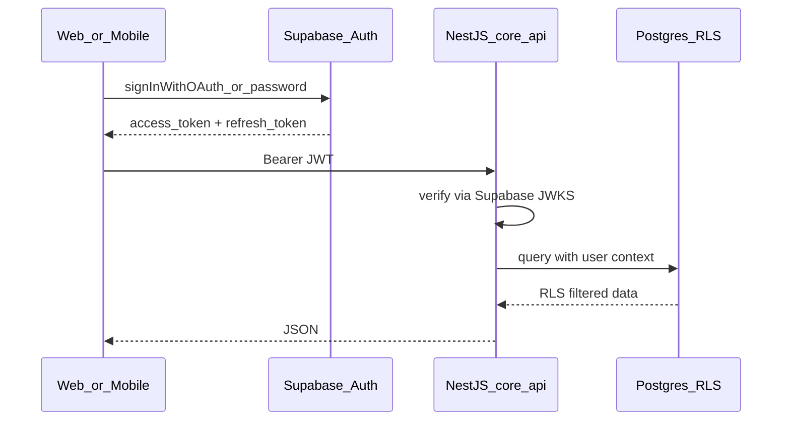
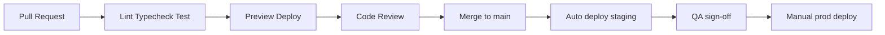
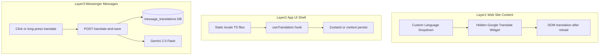

# SmolyanVote v2 — Greenfield Full Stack Plan

> Пълен blueprint за изграждане на SmolyanVote **от нулата** с enterprise best practices:
> бърз, красив, сигурен и maintainable stack с **пълен Supabase** + NestJS domain layer.

**Свързани документи:**
- [`MODERN_FRONTEND_PLAN.md`](MODERN_FRONTEND_PLAN.md) — incremental migration върху текущия Java backend
- [`DESIGN_BRIEF.md`](DESIGN_BRIEF.md) — canonical design tokens & UI patterns (v1 audit → v2)
- **Този документ** — greenfield rebuild (нов monorepo, нова архитектура)

---

## 1. Executive Summary

SmolyanVote v2 е multi-surface civic platform: voting, referendums, community, messenger, calls, admin, content modules и mobile app.

**Стратегия:** Turborepo monorepo + Supabase platform + NestJS за complex domain logic.

**Цели:**
- Premium UX (Linear / Vercel quality bar)
- LCP < 2.5s, API p95 < 300ms
- WCAG 2.2 AA accessibility
- Feature parity с текущия SmolyanVote
- Production-ready observability и security от day 1

**Timeline:** ~26 седмици с 2–3 full-stack developers.

---

## 2. Архитектурни принципи

| Принцип | Приложение |
|---------|------------|
| Clean Architecture | Domain logic в NestJS; UI без business rules |
| Contract-first API | OpenAPI → generated TypeScript client |
| Security by default | Supabase RLS + server-side auth в NestJS |
| Performance budget | LCP < 2.5s, TTI < 3.5s, API p95 < 300ms |
| Accessibility | WCAG 2.2 AA (Radix/shadcn) |
| Observability | OpenTelemetry + Sentry + structured logs |
| Test pyramid | Unit > integration > E2E |
| Incremental delivery | Vertical slices по modules, не big bang |
| Visual continuity | UI tokens от [`DESIGN_BRIEF.md`](DESIGN_BRIEF.md) — green civic identity, glass navbar |

---

## 3. Target Architecture



### 3.1 Роля на всеки слой

| Компонент | Отговорност |
|-----------|-------------|
| **Supabase Auth** | Identity, OAuth Google, JWT, refresh, mobile+web parity |
| **Supabase Postgres** | Source of truth, RLS, triggers |
| **Supabase Realtime** | Chat delivery, presence, live notifications |
| **Supabase Storage** | Avatars, event images, attachments, signed URLs |
| **Supabase Edge Functions** | Auth hooks, webhooks, lightweight proxies |
| **NestJS core-api** | Voting rules, admin, validation, LiveKit tokens, AI orchestration |
| **BullMQ + Redis** | Email, moderation, digests, retries |
| **LiveKit** | Voice/video WebRTC SFU |
| **FCM + Email** | Push notifications + transactional email |
| **Cloudflare** | CDN, WAF, DDoS protection, caching |
| **OpenTelemetry + Sentry** | Traces, metrics, errors |

### 3.2 Realtime (best practice)

**Hybrid подход (v2 default):**
- Supabase Realtime за message fanout, presence, in-app notifications, live vote result fanout
- NestJS за validation, permissions, business rules
- LiveKit за media (calls)
- **Vote writes винаги REST** — Realtime е read-side only (виж §3.3 Tier 3)

**Use cases по criticality:**

| Use case | Criticality | Channel pattern |
|----------|-------------|-----------------|
| Live vote results | **Highest** | `event:{id}:results` — postgres_changes или broadcast |
| Chat / typing / presence | Medium | `conversation:{id}` |
| In-app notifications | Lower | user channel; poll fallback acceptable |

**Capacity assumptions (Supabase Pro — design targets, verify against current Supabase docs before launch):**
- Plan load tests за **connections per channel** и **message throughput**, не само REST API
- Referendum peak scenario: 500–2000 concurrent subscribers на един results channel + sustained vote writes
- Monitor: reconnect rate, channel join latency, Realtime error rate в Grafana

### 3.3 Realtime Resilience & Fallback Ladder

Supabase Realtime работи добре до умерен concurrent load, но при civic peaks (последен час на референдум) channel saturation или outage не може да остави live voting без план.



**Tiered fallback (конкретен — не „monitor only“):**

| Tier | Trigger | Behavior |
|------|---------|----------|
| **0 — Normal** | Realtime healthy | Supabase channels за chat, presence, live vote counts |
| **1 — Degraded** | Channel saturation OR p95 fanout > threshold | Live vote UI → **SSE** (`GET /api/v1/events/{id}/results/stream`) или **5s poll**; chat остава Realtime |
| **2 — Realtime outage** | Supabase Realtime down > 2 min | NestJS **Socket.IO** gateway (pre-built Phase 6, feature-flagged off) за chat + presence; vote counts via SSE/poll |
| **3 — Vote path invariant** | Any tier | **`POST /api/v1/votes` винаги REST** — Realtime е само read-side fanout, никога write path |

**Implementation gates:**
- **Phase 4:** SSE vote results stream + client auto-fallback от Realtime към SSE/poll
- **Phase 6:** Socket.IO gateway scaffold (disabled by default); enable via feature flag при Tier 2
- **Phase 11:** Dedicated k6 scenario **„Referendum last hour“**

---

## 4. Tech Stack

### 4.1 Monorepo

- **Turborepo** + **pnpm workspaces**
- TypeScript strict mode навсякъde
- Shared ESLint/Prettier configs в `packages/config`

### 4.2 Frontend (web + admin)

| Технология | Версия/бележка |
|------------|----------------|
| Next.js | 15 App Router |
| React | 19 |
| TypeScript | strict |
| Tailwind CSS | v4 |
| UI | shadcn/ui + Radix UI |
| Motion | Framer Motion |
| i18n | next-intl (bg primary) |
| Themes | Light default per [`DESIGN_BRIEF.md`](DESIGN_BRIEF.md); dark mode optional Phase 2+ (feature flag) |
| Data | TanStack Query v5 |
| State | Zustand |
| Forms | React Hook Form + Zod |
| E2E | Playwright |

### 4.3 Mobile

| Технология | Версия/бележка |
|------------|----------------|
| Expo | SDK 52+ |
| Expo Router | file-based routing |
| Shared packages | api-client, supabase, types |
| E2E | Maestro или Detox |

### 4.4 Backend

| Технология | Версия/бележка |
|------------|----------------|
| NestJS | 11, modular Clean Architecture |
| Prisma | ORM → Supabase Postgres (pooler) |
| Redis | HA managed (Upstash / Redis Cloud prod); rate limits, BullMQ, idempotency cache — see **§7.6** |
| BullMQ | async jobs |
| OpenAPI | Swagger auto-gen |
| Validation | class-validator + Zod (shared schemas) |

### 4.5 Supabase (full platform)

- Auth, Postgres, Realtime, Storage, Edge Functions
- Row Level Security (RLS) на всички user-facing tables
- Database Webhooks → Edge Functions → worker queue
- Local dev: `supabase CLI` (`supabase start`)

### 4.6 External services

| Service | Use case |
|---------|----------|
| LiveKit | Voice/video calls |
| Firebase Cloud Messaging | Mobile push |
| Resend / Postmark | Transactional email |
| Google Gemini | Message translation |
| SightEngine | Image moderation |
| Cloudflare | CDN, WAF, DNS |

---

## 5. Monorepo Structure

```
smolyanvote-v2/
├── apps/
│   ├── web/                    # Next.js — public + authenticated web
│   ├── admin/                  # Next.js — admin console
│   └── mobile/                 # Expo — React Native
├── services/
│   ├── core-api/               # NestJS domain API
│   └── worker/                 # NestJS + BullMQ jobs
├── packages/
│   ├── ui/                     # Design system (web/admin)
│   ├── api-client/             # OpenAPI generated client
│   ├── supabase/               # supabase-js wrappers, hooks
│   ├── config/                 # eslint, tsconfig, env Zod schemas
│   ├── i18n/                   # translations
│   └── testing/                # mocks, test utils
├── supabase/
│   ├── migrations/             # SQL + RLS policies
│   ├── functions/              # Edge Functions
│   └── seed.sql
├── infra/
│   ├── docker/                 # docker-compose (Redis local)
│   └── github/                 # CI workflows
├── turbo.json
├── pnpm-workspace.yaml
└── README.md
```

---

## 6. NestJS Module Map

```
services/core-api/src/
├── modules/
│   ├── identity/       # Supabase JWT guard, user sync
│   ├── events/         # Simple events CRUD
│   ├── referendums/    # Referendums
│   ├── polls/          # Multi-polls
│   ├── voting/         # Vote casting, idempotency
│   ├── comments/       # Comments, reactions
│   ├── moderation/     # Reports, SightEngine queue
│   ├── messaging/      # Conversations, messages
│   ├── calls/          # LiveKit token minting
│   ├── notifications/  # Notification orchestration
│   ├── content/        # Podcast, publications, signals
│   ├── subscriptions/  # Email subscriptions
│   ├── admin/          # Admin operations
│   ├── audit/          # Append-only audit log
│   └── ai/             # Gemini message translation
├── common/
│   ├── guards/
│   ├── filters/        # Global exception filter
│   ├── interceptors/   # Logging, tracing
│   └── pipes/
└── main.ts
```

**Clean Architecture layers per module:**
- `domain/` — entities, value objects, domain services
- `application/` — use cases, DTOs
- `infrastructure/` — Prisma repositories, external clients
- `presentation/` — controllers, OpenAPI decorators

---

## 7. Supabase Setup Guide

### 7.1 Projects

| Environment | Supabase project | Branching |
|-------------|------------------|-----------|
| local | `supabase start` | n/a |
| staging | dedicated project | preview branches per PR |
| production | dedicated project | protected main |

### 7.2 Storage Buckets

| Bucket | Public | Use |
|--------|--------|-----|
| `avatars` | false | User profile images |
| `event-images` | true | Event/referendum media |
| `message-attachments` | false | Chat files |
| `publications` | true | Publication assets |
| `podcast` | true | Podcast covers/audio metadata |

Policies: signed URLs for private; CDN via Cloudflare in front of Supabase Storage public URLs.

### 7.3 RLS Policy Templates

```sql
-- Public read for published events
CREATE POLICY "events_public_read" ON events
  FOR SELECT USING (status = 'published');

-- Owner write
CREATE POLICY "events_owner_write" ON events
  FOR UPDATE USING (auth.uid() = owner_id);

-- Messages: participants only
CREATE POLICY "messages_participant" ON messages
  FOR SELECT USING (
    EXISTS (
      SELECT 1 FROM conversation_participants cp
      WHERE cp.conversation_id = messages.conversation_id
        AND cp.user_id = auth.uid()
    )
  );

-- Votes: insert once per user per event
-- UNIQUE (user_id, event_id) constraint + RLS insert check
```

### 7.4 Edge Functions

| Function | Trigger | Purpose |
|----------|---------|---------|
| `auth-on-signup` | Auth hook | Create profile row, welcome email job |
| `db-webhook-messages` | DB webhook | Enqueue push notification job |
| `livekit-token-proxy` | HTTP (optional) | Thin proxy; prefer NestJS for tokens |
| `health-check` | HTTP | Edge health probe |

### 7.5 Prisma + Supabase Connection

- **Migrations:** Prisma migrate in CI via `DIRECT_DATABASE_URL`
- **Runtime:** Supabase pooler (port **6543**, `?pgbouncer=true`)
- **Direct connection:** port **5432** only for migrations — never in app runtime
- **Service role:** NestJS worker only; never expose to clients

**Prisma datasource:**

```prisma
datasource db {
  provider  = "postgresql"
  url       = env("DATABASE_URL")        // pooler :6543 ?pgbouncer=true
  directUrl = env("DIRECT_DATABASE_URL") // :5432 migrations only
}
```

**Per-instance connection budget (mandatory):**

Prisma + multi-replica NestJS deployment може да exhaust-не pool при high concurrency без explicit limits.

```
connection_limit = floor((supabase_max_connections - headroom) / api_replica_count)
```

Пример (Supabase Pro, ~60 pool connections): 4 replicas × **10** connections = 40 used, **20** reserved за worker/migrations/monitoring.

- **`connection_limit` в `DATABASE_URL`** — задава се per deploy, не hardcoded
- **PgBouncer transaction mode** — `?pgbouncer=true`; без long-lived prepared statements в request handlers
- **Short transactions** — vote insert = single transaction, commit fast; no business logic inside DB tx
- **Health check:** `GET /health/db` — pool saturation metric + alert on pool wait time > 50ms

**Pre-launch load test gate (§14):**

| Scenario | Target | Gate |
|----------|--------|------|
| Concurrent vote writes | 200 req/s sustained 5 min | 0 connection pool timeouts |
| Mixed read/write | 500 concurrent API users | p95 < 300ms, pool wait < 50ms |
| Multi-replica | 4 NestJS instances | total connections ≤ Supabase budget |

### 7.6 Redis Architecture

Redis се ползва едновременно за rate limiting, BullMQ jobs и idempotency keys — **три критични функции на една infrastructure piece**. Production изисква HA стратегия и failure mode plan.

| Concern | Strategy |
|---------|----------|
| **Production topology** | **Upstash Redis** (managed, multi-AZ) OR **Redis Cloud** with replication — не single-node Docker в prod |
| **Local dev** | Docker Compose Redis (`infra/docker/`) — dev/staging only |
| **Rate limiting** | **Primary:** Cloudflare WAF rate rules (edge, Redis-independent); app-level Redis = secondary |
| **Idempotency keys** | Redis cache (24h TTL) + **Postgres fallback** table `idempotency_keys` — при Redis down vote path остава safe via DB UNIQUE |
| **BullMQ jobs** | Redis required; async/non-critical-path — queue pause acceptable; **votes never in queue** |
| **Fail-open vs fail-closed** | Rate limit: CF edge always on; **vote idempotency: fail-closed to DB constraint** |

**Failure mode matrix:**

| Redis down | Rate limit | Vote idempotency | BullMQ |
|------------|------------|------------------|--------|
| Impact | CF edge still limits | DB `UNIQUE(user_id, event_id)` prevents double vote | Email/push delayed |
| User-visible | Slightly higher abuse risk | **No double votes** | Notifications lag |

**Phase 0:** Select Redis HA provider (Upstash/Redis Cloud) + document failover runbook.

---

## 8. Database Schema (high-level)

### 8.1 Core tables

| Table | Description |
|-------|-------------|
| `users` | Profile extension (sync from Auth) |
| `events` | Simple civic events |
| `referendums` | Referendums |
| `multi_polls` | Multi-option polls |
| `votes` | Vote records (immutable) |
| `idempotency_keys` | Postgres fallback for idempotency when Redis unavailable |
| `comments` | Threaded comments |
| `comment_votes` | Comment reactions |
| `reports` | User reports |
| `moderation_queue` | Async moderation jobs |
| `conversations` | Chat threads |
| `conversation_participants` | Membership |
| `messages` | Chat messages |
| `message_translations` | Gemini cache |
| `notifications` | In-app notifications |
| `device_tokens` | FCM tokens |
| `call_history` | Call records |
| `publications` | Publications |
| `podcast_episodes` | Podcast |
| `signals` | Citizen signals |
| `email_subscriptions` | Newsletter |
| `audit_events` | Immutable admin audit |
| `media_assets` | Storage metadata |

### 8.2 Indexing strategy

- Composite indexes on `(status, created_at DESC)` for listings
- GIN full-text on event title/description (optional Phase 3+)
- Partial indexes on `notifications(user_id, read_at)` where `read_at IS NULL`

---

## 9. API Design Standards

### 9.1 Versioning

- Base path: `/api/v1`
- Breaking changes → `/api/v2`
- Deprecation headers: `Sunset`, `Deprecation`

### 9.2 Error format

```json
{
  "error": {
    "code": "VOTE_ALREADY_CAST",
    "message": "Вече сте гласували в това събитие.",
    "details": {},
    "requestId": "uuid"
  }
}
```

HTTP status codes: 400 validation, 401 unauthenticated, 403 forbidden, 404 not found, 409 conflict, 429 rate limit, 500 internal.

### 9.3 Pagination

```json
{
  "data": [],
  "meta": {
    "page": 1,
    "pageSize": 20,
    "total": 142,
    "hasNext": true
  }
}
```

Cursor-based pagination for chat messages.

### 9.4 Idempotency

- **Voting:** `Idempotency-Key` header + DB `UNIQUE(user_id, event_id)` — **DB constraint е source of truth**
- **Redis idempotency cache:** optimization layer (24h TTL) — not required for vote integrity
- **Postgres fallback:** `idempotency_keys(key, response_hash, expires_at)` — used when Redis miss/down
- Other mutating POST endpoints: same pattern where applicable

**Layering:**
1. Redis hit → return cached response (fast path)
2. Redis miss → insert with DB constraint
3. Redis down → Postgres `idempotency_keys` + DB UNIQUE still prevent duplicates

### 9.5 Vote Integrity Under Concurrency

Правилният pattern за civic voting под concurrent writes — не generic template:

**Concurrency model:**

1. Client sends `POST /api/v1/votes` with `Idempotency-Key`
2. NestJS: check Redis idempotency cache → if miss, `INSERT INTO votes ... ON CONFLICT DO NOTHING`
3. DB `UNIQUE(user_id, event_id)` — **final arbiter under race conditions**
4. Return `409 VOTE_ALREADY_CAST` on conflict
5. Live results update via DB trigger → Realtime/SSE broadcast (**read path only**)

**Explicit non-goals:**
- No optimistic double-submit without server ack
- No Realtime for vote writes
- No queue-based vote processing

**Integration test (Phase 4 + CI):** 10 parallel vote requests for same user+event → exactly **1** succeeds, 9 return 409.

---

## 10. Auth Flow



| Client | Implementation |
|--------|----------------|
| Web | `@supabase/ssr` + Next.js middleware |
| Mobile | `@supabase/supabase-js` + Expo SecureStore |
| Admin | Same as web + `app_role=admin` in user metadata |
| NestJS | `SupabaseAuthGuard`, extract `sub`, roles |

---

## 11. Messaging & Calls

### 11.1 Chat flow

1. `POST /api/v1/conversations` — create/get conversation
2. `POST /api/v1/messages` — NestJS validates + inserts
3. Supabase Realtime `postgres_changes` on `messages` table
4. Clients subscribe to `conversation:{id}` channel
5. Presence on same channel
6. Typing: ephemeral Realtime broadcast (not persisted)

### 11.2 Translation

1. `POST /api/v1/messages/{id}/translate` — check cache
2. Miss → Gemini API → store in `message_translations`
3. Return translated text

### 11.3 Calls (LiveKit)

1. `POST /api/v1/calls/initiate` — create call record
2. `POST /api/v1/calls/token` — mint LiveKit JWT
3. FCM push to callee (worker)
4. Client connects to LiveKit room
5. `call_history` updated on end

---

## 12. Feature Parity Map

| Domain | Current Java | v2 Module | Store |
|--------|--------------|-----------|-------|
| Home/SEO | MainController | apps/web SSR | Postgres |
| Events | MainEventsController | core-api/events | Postgres |
| Simple events | SimpleEventController | core-api/events | Postgres + Storage |
| Referendums | ReferendumController | core-api/referendums | Postgres |
| Multi-polls | MultiPollController | core-api/polls | Postgres |
| Voting | VoteController | core-api/voting | Postgres |
| Auth | Login/OAuth/JWT | Supabase Auth + identity | Supabase |
| Profile | UserController | core-api/users | Postgres |
| Comments | CommentsController | core-api/comments | Postgres |
| Reports | ReportsController | core-api/moderation | Postgres |
| Notifications | NotificationController | Realtime + worker | Postgres |
| SVMessenger | WebSocket handlers | Realtime + messaging | Postgres |
| Calls | LiveKit | core-api/calls | LiveKit |
| Translation | GeminiTranslationService | core-api/ai | Postgres cache |
| Podcast | PodcastController | core-api/content | Postgres + Storage |
| Publications | PublicationsController | core-api/content | Postgres |
| Signals | SignalsController | core-api/signals | Postgres |
| Subscriptions | SubscriptionController | core-api/subscriptions | Postgres |
| Admin | Admin* controllers | apps/admin + core-api/admin | Postgres |
| Activity log | ActivityLoggingAspect | core-api/audit | Postgres |
| Push | Firebase Admin | worker + FCM | Postgres |
| Email | Mailjet | worker + Resend | Queue |
| Images | Cloudinary | Supabase Storage | Storage |
| Rate limit | bucket4j | Redis + Cloudflare | Redis |

---

## 13. Design System

> **Canonical source:** [`DESIGN_BRIEF.md`](DESIGN_BRIEF.md) — пълен audit на v1 SmolyanVote + token export за v2.
> Тази секция е summary; при conflict DESIGN_BRIEF печели.

### 13.1 Design tokens (summary)

**Brand green (не civic blue):**

| Token | Value | Usage |
|-------|-------|--------|
| `--color-primary-500` | `#19861c` | Main brand green, CTAs |
| `--color-primary-300` | `#48a24c` | Accent, gradients |
| Primary gradient | `linear-gradient(135deg, #19861c, #48a24c)` | Logo, hero CTAs |
| `--color-text-primary` | `#2C3E50` | Body headings |
| `--color-text-secondary` | `#5A6C7D` | Secondary copy |
| `--color-gold-500` | `#c9a961` | **Messenger only** — not web primary |

**Typography:** Inter (headings), Manrope (display/subtitles), Source Sans 3 (body), IBM Plex Sans (nav/buttons).

**Spacing:** 4px base scale. **Radius:** sm 8px, md 12px, lg 20px, xl 28px (app promo), pill 999px.

**Motion:** fast 150–200ms, normal 250–400ms; hero entrance 1.2s; respect `prefers-reduced-motion`.

**Export:** `packages/ui/tokens.ts` — copy from DESIGN_BRIEF §13 v2 export block.

### 13.2 Component library

Button, Input, Textarea, Select, Card, Badge, Avatar, Dialog, Sheet, Toast, Skeleton, Tabs, DataTable, DropdownMenu, Command (search).

**v2-specific components (match DESIGN_BRIEF §10):**
- `Navbar` — glassmorphism, icon+label, underline hover (not pill fill)
- `Hero` — full-bleed photography + light overlay + glass CTAs
- `AppPromoCard` — SVMessenger promo (28px radius, green radial wash)
- `VoteWidget` — optimistic UI with server ack
- `ChatBubble` — emerald sent gradient (web); gold accents in mobile messenger

### 13.3 UX patterns

- Hero with **photography background** + glass CTAs (not gradient mesh)
- Glass fixed navbar with gradient fade + `backdrop-filter: blur(5px)`
- Nav links: icon + label always visible; **underline hover** on desktop
- Event cards with image, status badge, vote count
- Vote widget with optimistic UI + error recovery (409 handling)
- Chat bubbles with read receipts, typing indicator
- Admin data tables with filters, bulk actions
- Empty states with illustration + action
- Skeleton loaders on all async content
- **Light-first web** — v1 behavior preserved; dark mode optional behind flag

### 13.4 Quality bar

Reference: Linear, Vercel clarity + SmolyanVote civic warmth (green, photography, glass).
shadcn mapping: see DESIGN_BRIEF §13 shadcn table (`--primary: #19861c`).

---

## 14. Testing Strategy

| Layer | Tool | Coverage target |
|-------|------|-----------------|
| Unit (domain) | Vitest / Jest | 80%+ domain logic |
| Unit (UI) | Vitest + Testing Library | Critical components |
| Integration (API) | Supertest + test DB | All endpoints |
| E2E web | Playwright | Happy paths + auth |
| E2E mobile | Maestro | Login, chat, vote |
| Load — REST API | k6 | 500 concurrent users; vote writes 200 req/s |
| Load — Realtime | k6 + custom WS client | „Referendum last hour“: 500–2000 channel subscribers |
| Load — Prisma pool | k6 multi-replica | 4 instances; 0 pool timeouts; pool wait < 50ms |
| Security | OWASP ZAP | Phase 11 |
| Vote concurrency | Integration test | 10 parallel votes → 1 success (CI gate) |

**Launch gates (Phase 11 — all must pass):**
- Realtime load test OR Tier 1 SSE fallback verified under peak scenario
- Prisma pool saturation test with production replica count
- Concurrent vote integration test in CI

**CI gate:** no merge without lint + typecheck + unit tests pass.

---

## 15. Observability

| Signal | Tool |
|--------|------|
| Traces | OpenTelemetry → Grafana Tempo / Honeycomb |
| Metrics | Prometheus / Grafana |
| Errors | Sentry (web, mobile, NestJS) |
| Logs | Structured JSON, correlation ID per request |
| Uptime | Better Stack / Pingdom |
| Dashboards | Grafana: API latency, error rate, queue depth |

Every API response includes `X-Request-Id` header.

---

## 16. Security Checklist

- [ ] RLS enabled on all user-facing tables
- [ ] NestJS validates JWT on every protected route
- [ ] Service role key never in client code
- [ ] Storage bucket policies + signed URLs for private content
- [ ] Rate limiting: Cloudflare (edge, primary) + Redis (application, secondary)
- [ ] Redis HA in production (Upstash/Redis Cloud) — see §7.6
- [ ] CORS strict allowlist per environment
- [ ] Secrets in Doppler / Supabase vault — not in git
- [ ] Dependabot + npm audit in CI
- [ ] OWASP ASVS Level 2 for auth flows
- [ ] Admin actions logged to immutable `audit_events`
- [ ] Vote integrity: DB constraints + server-side validation + concurrent vote test (§9.5)
- [ ] Image moderation pipeline before public display

---

## 17. CI/CD Pipeline



| Stage | Action |
|-------|--------|
| PR | ESLint, Prettier, tsc, unit tests, build |
| Preview | Vercel preview (web/admin), Fly.io/Railway preview (API), Supabase branch DB |
| Staging | Auto-deploy on merge to `main` |
| Production | Tagged release, manual approval, migration review |

**DB migrations:** never auto-run on prod without reviewed PR + backup.

---

## 18. Local Development

### 18.1 Prerequisites

- Node.js 20 LTS, pnpm 9+, Docker Desktop
- Supabase CLI
- Expo CLI (mobile)

### 18.2 Commands

```bash
# Clone new monorepo
git clone <smolyanvote-v2-repo>
cd smolyanvote-v2
pnpm install

# Start Supabase local stack
supabase start

# Start Redis (docker)
docker compose -f infra/docker/docker-compose.yml up -d

# Copy env
cp .env.example .env.local

# Run all apps
pnpm dev
```

### 18.3 Ports

| Service | Port |
|---------|------|
| web | 3000 |
| admin | 3001 |
| core-api | 4000 |
| worker | n/a (background) |
| Supabase Studio | 54323 |
| Supabase API | 54321 |
| Redis | 6379 |

---

## 19. Deployment Architecture (Production)

```
smolyanvote.com          → Vercel (web)
admin.smolyanvote.com    → Vercel (admin)
api.smolyanvote.com      → Fly.io / Railway (core-api + worker)
Supabase                 → Managed (DB, Auth, Realtime, Storage)
LiveKit Cloud            → Calls
Cloudflare               → DNS, CDN, WAF
FCM                      → Mobile push
```

---

## 20. Phased Delivery

### Phase 0 — Foundation (2 weeks)

- [ ] Turborepo scaffold + pnpm workspaces
- [ ] CI pipeline (lint, test, build)
- [ ] Supabase staging + prod projects
- [ ] NestJS skeleton + Prisma + health endpoint (`/health/db` pool check)
- [ ] `packages/ui` — port tokens from [`DESIGN_BRIEF.md`](DESIGN_BRIEF.md) + Button, Card, Input
- [ ] Redis HA provider selected (Upstash/Redis Cloud); local Docker for dev only
- [ ] OpenTelemetry + Sentry integration
- [ ] Env validation (Zod schemas)

### Phase 1 — Identity (2 weeks)

- [ ] Supabase Auth: email/password, Google OAuth
- [ ] Auth trigger → `users` profile row
- [ ] RLS policies for users
- [ ] NestJS identity module + JWT guard
- [ ] Web: login, register, password reset
- [ ] Mobile: auth screens + SecureStore

### Phase 2 — Public Web Shell (2 weeks)

- [ ] Next.js layout: Navbar (glass + underline hover per DESIGN_BRIEF §10.1), Footer
- [ ] Home page hero + stats (photography hero, not gradient mesh)
- [ ] SEO: metadata, sitemap, robots.txt
- [ ] Hidden Google Translate + LanguageSwitcher — see **§27.3 Layer 1**
- [ ] Cloudflare DNS + preview deploys
- [ ] Light theme default (DESIGN_BRIEF); dark mode optional behind feature flag

### Phase 3 — Civic Core Read (3 weeks)

- [ ] `GET /api/v1/events` with filters/pagination
- [ ] Event/referendum/poll detail pages (SSR)
- [ ] JSON-LD structured data
- [ ] Search (Postgres full-text or Meilisearch)

### Phase 4 — Voting Write (2 weeks)

- [ ] `POST /api/v1/votes` with idempotency (Redis + DB UNIQUE — §9.4, §9.5)
- [ ] DB unique constraints + audit log
- [ ] Concurrent vote integration test (10 parallel → 1 success)
- [ ] SSE live results stream (`GET /api/v1/events/{id}/results/stream`) + Realtime fallback client
- [ ] Optimistic UI + error recovery (409 handling)
- [ ] Vote result visualization

### Phase 5 — Community (2 weeks)

- [ ] Comments CRUD + reactions
- [ ] Reports flow
- [ ] Moderation worker + SightEngine integration

### Phase 6 — Messaging (4 weeks)

- [ ] Conversations + messages API
- [ ] Supabase Realtime subscriptions
- [ ] Socket.IO gateway scaffold (feature-flagged off — Tier 2 fallback §3.3)
- [ ] Web chat UI
- [ ] Mobile chat UI
- [ ] Translation cache (Gemini) — see **§27.5 Layer 3**
- [ ] Presence + typing indicators

### Phase 7 — Calls (2 weeks)

- [ ] LiveKit token endpoint
- [ ] Call initiate/accept/decline/end
- [ ] Call history UI
- [ ] FCM incoming call push

### Phase 8 — Notifications (2 weeks)

- [ ] In-app notifications (Realtime)
- [ ] FCM push (worker)
- [ ] Email digests (worker)
- [ ] Notification preferences

### Phase 9 — Content (2 weeks)

- [ ] Podcast module
- [ ] Publications module
- [ ] Signals module

### Phase 10 — Admin (3 weeks)

- [ ] Admin app: dashboard metrics
- [ ] User management (ban, roles)
- [ ] Reports queue
- [ ] Activity audit wall

### Phase 11 — Hardening & Launch (2 weeks)

- [ ] Load testing — REST API (k6)
- [ ] Load testing — Realtime channels („Referendum last hour“ scenario)
- [ ] Load testing — Prisma pool saturation (multi-replica)
- [ ] Verify Tier 1 SSE fallback under Realtime saturation
- [ ] Security audit
- [ ] Performance optimization pass
- [ ] Production deploy + monitoring dashboards (Realtime + pool metrics)
- [ ] Runbook + incident response docs (Realtime Tier 2, Redis failover)

**Total: ~26 weeks** with 2–3 full-stack developers.

---

## 21. Team & Roles

| Role | Responsibility | FTE |
|------|----------------|-----|
| Tech Lead / Architect | Architecture, code review, API design | 0.5–1 |
| Full-stack Developer | NestJS + Next.js features | 2 |
| Mobile Developer | Expo app | 0.5–1 |
| UI/UX Designer | Design system, mockups | 0.5 |
| DevOps (part-time) | CI/CD, Cloudflare, Supabase ops | 0.25 |

---

## 22. Cost Estimate (monthly, production)

| Service | Tier | ~Cost |
|---------|------|-------|
| Supabase | Pro | $25–75 |
| Vercel | Pro | $20–40 |
| Fly.io / Railway | API + worker | $30–80 |
| LiveKit Cloud | Usage-based | $50–200 |
| Cloudflare | Pro | $20 |
| Resend | Email | $20 |
| Sentry | Team | $26 |
| FCM | Free tier | $0 |
| Gemini API | Usage-based | $20–100 |
| **Total** | | **~$200–550/mo** |

Scales with users; budget buffer recommended.

---

## 23. Risk Register

| Risk | Impact | Mitigation |
|------|--------|------------|
| Scope creep | Delay | Strict phase gates, MVP per phase |
| Supabase vendor lock-in | Medium | Prisma abstracts DB; export backups |
| Realtime scale limits | **High** | Tier 0–3 fallback ladder (§3.3); SSE Phase 4; Socket.IO scaffold Phase 6; Realtime-specific load test Phase 11 |
| Prisma connection exhaustion | **High** | Per-instance `connection_limit`; short transactions; pool saturation load test; alert on pool wait |
| Redis SPOF | Medium–High | HA Redis (Upstash/Redis Cloud); CF edge rate limit; DB UNIQUE + `idempotency_keys` fallback (§7.6) |
| AI cost overrun | Low | Cache translations; rate limits |
| Team capacity | High | Phase 0–3 first; defer content modules if needed |
| Data migration from v1 | High | Separate migration project if replacing prod |

---

## 24. Environment Variables

### 24.1 Shared

```
NODE_ENV=development|staging|production
```

### 24.2 Supabase (all apps)

```
NEXT_PUBLIC_SUPABASE_URL=
NEXT_PUBLIC_SUPABASE_ANON_KEY=
SUPABASE_SERVICE_ROLE_KEY=        # server only
DATABASE_URL=                     # Prisma pooler URL
DIRECT_DATABASE_URL=              # migrations only
```

### 24.3 NestJS core-api

```
PORT=4000
REDIS_URL=redis://localhost:6379
JWT_JWKS_URL=                     # Supabase JWKS endpoint
LIVEKIT_API_KEY=
LIVEKIT_API_SECRET=
LIVEKIT_URL=
GEMINI_API_KEY=
SIGHTENGINE_USER=
SIGHTENGINE_SECRET=
OTEL_EXPORTER_OTLP_ENDPOINT=
SENTRY_DSN=
```

### 24.4 Worker

```
REDIS_URL=
FCM_SERVICE_ACCOUNT_JSON=
RESEND_API_KEY=
```

### 24.5 Next.js web/admin

```
NEXT_PUBLIC_API_URL=https://api.smolyanvote.com
NEXT_PUBLIC_SUPABASE_URL=
NEXT_PUBLIC_SUPABASE_ANON_KEY=
SENTRY_DSN=
```

### 24.6 Expo mobile

```
EXPO_PUBLIC_SUPABASE_URL=
EXPO_PUBLIC_SUPABASE_ANON_KEY=
EXPO_PUBLIC_API_URL=
```

---

## 25. Relationship to Current SmolyanVote Repo

| Path | Purpose |
|------|---------|
| Current `smolyanVote/` (Java) | Production v1 — maintain during frontend migration |
| **`MODERN_FRONTEND_PLAN.md`** | **Primary path (chosen):** new Next.js frontend on Java backend |
| `GREENFIELD_FULL_STACK_PLAN.md` | Full rebuild reference — not chosen; reuse design/multilingual/vote patterns only |
| `DESIGN_BRIEF.md` | Canonical UI tokens for both paths |

**Decision:** **MODERN frontend migration is the active path.** Greenfield v2 remains reference/archive; can live in a separate repo (`smolyanvote-v2`) if pursued later.

**Reusable from v1:** domain knowledge, UX patterns, content, branding assets — not Java code.

---

## 27. Multilingual Strategy (preserve v1 behavior — mandatory)

SmolyanVote v1 използва **3 отделни translation системи**. В v2 **всички три се запазват 1:1** по behavior — не се заменят с един generic i18n подход.

### 27.1 Три слоя (architecture)



| Layer | Scope | Engine | Google visible? |
|-------|-------|--------|-----------------|
| **Layer 1** | Web pages: events, referendums, UGC, HTML content | Hidden Google Website Translator | **No** — custom UI + CSS hide |
| **Layer 2** | App shell: navbar, settings, buttons, labels | Static translation files | N/A |
| **Layer 3** | Chat message text (received only) | Gemini AI + per-user DB cache | N/A |

**v1 reference files:**
- Web: `src/main/resources/static/js/navbar.js`, `navbar.css`, `fragments/navbar.html`
- Mobile i18n: `SVMessengerMobile/src/translations/*`, `hooks/useTranslation.ts`
- Messenger: `TranslationController.java`, `GeminiTranslationService.java`, `MessageTranslationEntity.java`

### 27.2 Supported languages (single registry)

Central config in `packages/config/languages.ts`:

```typescript
export const SUPPORTED_LANGUAGES = [
  'bg', 'en', 'el', 'tr', 'ru', 'de', 'fr', 'es', 'iw', 'zh-CN',
] as const;
```

Used by: web dropdown, mobile settings, messenger translate menu.

**Source language for web content:** always `bg` (same as v1 `pageLanguage: 'bg'`).

### 27.3 Layer 1 — Web: Hidden Google Translate (Next.js)

**Why not replace with next-intl only:** user-generated content (event descriptions, comments rendered in HTML) would require manual translation of thousands of strings. Hidden Google Translate translates **entire DOM** including DB content.

**v2 package:** `packages/i18n-web-translate/`

```
packages/i18n-web-translate/
├── GoogleTranslateProvider.tsx   # client-only; loads Google script
├── translateTo.ts                # cookie + sessionStorage + reload logic
├── applyStoredLanguage.ts        # on mount / inline head script
├── google-translate.css          # hide ALL Google UI (port from navbar.css)
├── LanguageSwitcher.tsx          # custom dropdown with flags (same UX)
└── index.ts
```

**Implementation rules (port from v1):**

1. Hidden container: `<div id="google_translate_element" style={{ display: 'none' }} />`
2. Init: `new google.translate.TranslateElement({ pageLanguage: 'bg' }, 'google_translate_element')`
3. Script: `//translate.google.com/translate_a/element.js?cb=googleTranslateElementInit`
4. `translateTo(lang)`:
   - Delete all `googtrans` cookies (path + domain variants)
   - Set `googtrans=/bg/${lang}; path=/; max-age=31536000`
   - `sessionStorage.setItem('selectedLanguage', lang)`
   - `location.reload()` (or `router.refresh()` + full reload if needed)
5. `applyStoredLanguage()` on `DOMContentLoaded` / layout mount
6. CSS must hide: `#google_translate_element`, `.goog-te-banner-frame`, `.goog-te-balloon-frame`, `.goog-te-gadget`, `.skiptranslate`, fix `body { top: 0 !important }`

**Next.js integration (`apps/web`):**

- `GoogleTranslateProvider` in root layout (client component)
- Import `google-translate.css` globally
- Optional inline script in `<head>` to apply cookie before first paint (reduce BG flicker)
- `suppressHydrationWarning` on `<html>` if needed

**Do NOT:**
- Show Google Translate toolbar/banner
- Replace site-wide translation with next-intl for dynamic UGC
- Change cookie format from `/bg/{lang}`

**Optional hybrid:** `next-intl` only for static shell strings (navbar labels) while Google Translate handles page body — acceptable.

### 27.4 Layer 2 — App UI: Static i18n files

**Port from:** `SVMessengerMobile/src/translations/`

**v2 package:** `packages/i18n/`

```
packages/i18n/
├── locales/
│   ├── bg.ts, en.ts, el.ts, tr.ts, ru.ts, de.ts, fr.ts, es.ts, iw.ts, zh-CN.ts
├── useTranslation.ts             # dot-key lookup, fallback to bg
├── supportedLanguages.ts         # flags + labels
└── index.ts
```

**Consumers:**
- `apps/mobile` — Expo (Zustand persist `language` in AsyncStorage)
- `apps/web` — optional for navbar/settings labels only
- `apps/admin` — admin UI strings

**Hook behavior (preserve v1):**
- `t('settings.title')` — dot-notated keys
- Missing key → fallback to Bulgarian → then return key
- Language switch: instant, no page reload

**Mobile Settings UI:** horizontal flag picker (same 10 languages as v1 SettingsScreen).

### 27.5 Layer 3 — Messenger: Gemini + per-user cache

**Port from:** `TranslationController`, `GeminiTranslationService`, `MessageTranslationEntity`

**v2 NestJS module:** `services/core-api/src/modules/ai/` + `modules/messaging/`

**API contract (preserve):**

```
POST /api/v1/messages/{messageId}/translate
Body: { "targetLanguage": "en" }
Response: {
  "messageId": 123,
  "translatedText": "...",
  "targetLanguage": "en",
  "cached": true
}
```

(v1 path `/api/svmessenger/translate-and-save` → alias or migrate to v1-compatible route)

**Database (Prisma):**

```prisma
model MessageTranslation {
  id             BigInt   @id @default(autoincrement())
  messageId      BigInt
  userId         String   // Supabase auth user id
  targetLanguage String   @db.VarChar(10)
  translatedText String   @db.Text
  createdAt      DateTime @default(now())

  @@unique([messageId, userId, targetLanguage])
  @@map("message_translations")
}
```

**Business rules (mandatory — same as v1):**

- User can translate **received messages only** (not own)
- Cache is **per user** (same message, different users → separate rows)
- Cache hit → return immediately, no Gemini call
- Gemini prompt: *"Translate to {lang}. Maintain tone. Do only the translation, no explanation."*
- Model: `gemini-2.5-flash` (or successor with same behavior)

**Clients:**
- Web messenger: click message → language menu → show translated text inline in bubble
- Mobile: long-press → translate menu (`MessageBubble.tsx` behavior)
- Port UI from: `svmessenger-frontend/SVMessageItem.jsx`, `SVMessengerMobile/MessageBubble.tsx`

### 27.6 Phase integration

| Phase | Multilingual deliverable |
|-------|-------------------------|
| Phase 0 | `packages/config/languages.ts`, `packages/i18n` skeleton |
| Phase 2 | Web `LanguageSwitcher` + hidden Google Translate in layout |
| Phase 1 | Mobile language picker + `useTranslation` |
| Phase 6 | Messenger translate API + Gemini + `message_translations` table |
| Phase 6 | Web + mobile chat translate UI |

### 27.7 v2 acceptance criteria (translation)

- [ ] Web: 10 languages via custom dropdown; no visible Google branding
- [ ] Web: user-generated event text translates after language switch + reload
- [ ] Web: language persists across sessions (cookie + sessionStorage)
- [ ] Mobile: instant UI language switch via static files (10 languages)
- [ ] Messenger: click/long-press translate on received messages only
- [ ] Messenger: second translate request returns `cached: true`
- [ ] Messenger: own messages cannot be translated (400 error)
- [ ] Same language codes across web, mobile, messenger

### 27.8 Explicit non-goals

- Do not expose Google Translate widget or banner to users
- Do not use Google Translate for messenger chat (Gemini only)
- Do not use Gemini for entire website translation (too slow/expensive)
- Do not require manual translation files for all event/referendum body text

---

## 26. Next Steps

1. Review and approve this plan
2. Create `smolyanvote-v2` repository
3. Execute Phase 0 checklist
4. Set up Supabase staging project
5. Weekly demos per phase gate

---

## Appendix A — Implementation Todo Summary

1. [ ] Create `smolyanvote-v2` monorepo (Turborepo)
2. [ ] Supabase projects + local CLI setup
3. [ ] NestJS core-api + Prisma schema v0
4. [ ] packages/ui design system — tokens from DESIGN_BRIEF.md
5. [ ] packages/supabase + packages/api-client
6. [ ] packages/i18n (Layer 2 static translations — port from mobile v1)
7. [ ] packages/i18n-web-translate (Layer 1 hidden Google Translate)
8. [ ] apps/web Phase 0 shell + LanguageSwitcher
9. [ ] CI/CD pipeline
10. [ ] Phase 1–11 per section 20
11. [ ] Phase 6: message_translations + Gemini translate API (Layer 3)

---

*Document version: 1.2 — Greenfield Full Stack Plan (multilingual §27, Realtime fallback §3.3, Redis HA §7.6, DESIGN_BRIEF §13)*
