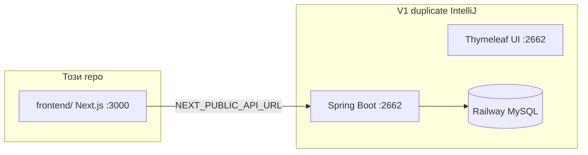
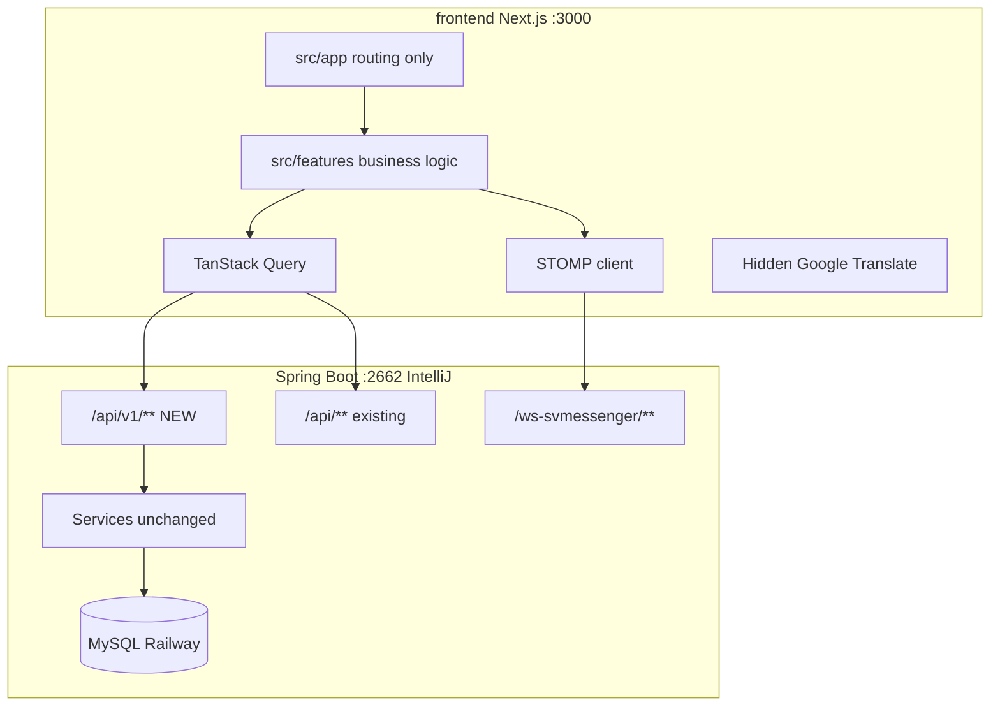
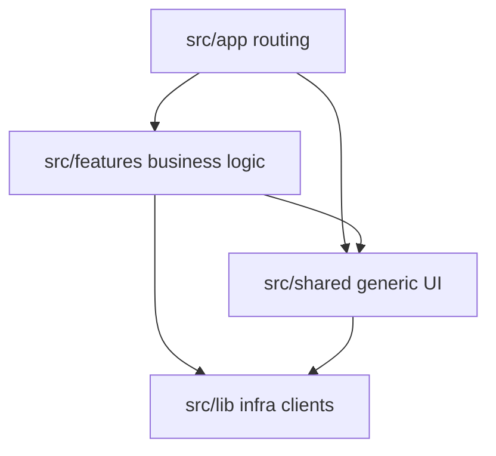

# Modern Frontend Migration — SmolyanVote (Plan v2)

> Roadmap за **изцяло нов frontend** (React 19 + Next.js 15 + Tailwind CSS + TypeScript),
> комуникиращ с **съществуващия Spring Boot backend** без rewrite на Java business logic.
>
> Целият нов UI живее в **`frontend/`** в главната директория на repo-то.

**Свързани документи:**
- [`DESIGN_BRIEF.md`](DESIGN_BRIEF.md) — canonical design tokens & UI patterns (v1 audit → Next.js)
- [`FULL_STACK_APP_REDESIGN_PLAN.md`](FULL_STACK_APP_REDESIGN_PLAN.md) — **не е избран path**; reference за domain ideas

---

## Избран path

| Path | Статус |
|------|--------|
| **Този документ** (Next.js + Java) | **Primary** — пълна замяна на frontend, Java backend без rewrite |
| Full-stack redesign (NestJS + Supabase) | Archive/reference only |
| Thymeleaf UI | Постепенно заменя се (Strangler Fig); v1 се пуска от **дубликат в IntelliJ** |

**Reuse от redesign plan (без Supabase/NestJS):** DESIGN_BRIEF tokens, multilingual 3-layer strategy, vote integrity patterns, realtime fallback ladder (адаптиран за STOMP/Java).

---

## Цел

| Deliverable | Локация | Описание |
|-------------|---------|----------|
| Този документ | `MODERN_FRONTEND_PLAN.md` | Roadmap, architecture, API contract, фази |
| Next.js app | `frontend/` | Feature-based `src/`, design system, API client, i18n |
| Java промени | v1 duplicate (IntelliJ) | CORS + `/api/v1/*` endpoints |

**Принцип:** Strangler Fig е само migration **механизъм** — постепенна замяна на Thymeleaf UI, backend services остават. **Крайна цел: пълно премахване на Thymeleaf** (не само archive) — виж Фаза 10.

**Visual continuity:** UI tokens от [`DESIGN_BRIEF.md`](DESIGN_BRIEF.md) — green civic identity, glass navbar, photography hero.

**Dev URLs (фиксирани):**
- **Нов frontend:** `http://localhost:3000` (`npm run dev`)
- **Java backend + v1 UI:** `http://localhost:2662` (IntelliJ duplicate)

---

## No-reload / Real-time-first (водещ принцип)

> Абсолютно правило за целия нов frontend: **никакви презареждания на страницата и никакви full form round-trips за данни**. Всичко, което може да се случва в реално време, се случва в реално време.

- **Забранено:** `location.reload()`, `form.submit()` full round-trip, `window.location.href = ...` за data updates, reload след мутация. Единственото допустимо изключение: Google Translate cookie apply (i18n Layer 1).
- **Real-time където е възможно (задължително):** vote броячи, коментари и реплики, нотификации, sidebar widgets, feed, follow/like/bookmark — live update чрез **TanStack Query cache mutation + STOMP/SSE**, не чрез refetch на цялата страница.
- **Мутациите** обновяват локалния cache оптимистично (rollback при грешка), после се потвърждават от сървъра — никога reload.
- **Навигацията** е client-side (Next.js router) — без full page loads между вътрешни страници.
- **Thymeleaf + reload логиката от V1 не се пренасят.** Целият reload-базиран поток (filter `form.submit()`, vote reload, `location.reload()` след действие) се заменя, не се мигрира. End-state: нула Thymeleaf.

---

## Repository layout & dev workflow



**Правила:**
- В **този repo** живее **само** `frontend/` — **без** `gradlew bootRun` тук.
- V1 Java + Thymeleaf се стартират от **дубликат на проекта в IntelliJ** на `http://localhost:2662`.
- `.env.local`: `NEXT_PUBLIC_API_URL=http://localhost:2662`
- CORS в Java (IntelliJ duplicate): allowlist `http://localhost:3000` и `http://127.0.0.1:3000`

### Сравнение old vs new UI

| Tab | URL | Auth |
|-----|-----|------|
| Нов Next.js | `http://localhost:3000` | JWT (`/api/mobile/auth/*`) |
| Стар Thymeleaf | `http://localhost:2662` | Session cookies |

Login в един tab **не** логва автоматично в другия. За UI comparison: public pages или login и в двата.

---

## System architecture



**Auth:** JWT access + refresh от `MobileAuthController`.

**Vote writes:** винаги REST (`POST /api/v1/votes`) — никога през WebSocket.

---

## Tech Stack (`frontend/`)

> Пълният, per-функция избор на библиотеки е в раздел [Модерен библиотечен стек (2026)](#модерен-библиотечен-стек-2026).

| Слой | Технология |
|------|------------|
| Framework | Next.js 16 (App Router, `src/` directory) |
| UI | React 19 + TypeScript strict |
| Styling | Tailwind CSS v4 |
| Components | **shadcn/ui върху Base UI** (дефолт от юли 2026) в `src/shared/ui/` |
| Icons | **Lucide** (`flag-icons` само за езици) |
| Animations | **Motion** (ex-Framer Motion) |
| Data fetching | TanStack Query v5 |
| Tables / lists | **TanStack Table** + **TanStack Virtual** |
| Charts | **Recharts v3** (общи) + **Nivo/ECharts** (admin аналитики) |
| Maps | **MapLibre GL JS** + `react-map-gl` + supercluster |
| Media | **WaveSurfer v7** (подкаст), **Vidstack** (видео), **LiveKit** (обаждания) |
| Toasts / overlay | **Sonner** + Base UI Dialog/AlertDialog/Popover |
| Emoji / gallery / carousel | **Frimousse** / **yet-another-react-lightbox** / **Embla** |
| Forms | React Hook Form + Zod |
| Client state | **Zustand** (сложно UI/messenger състояние) |
| URL state | **nuqs** (type-safe search params — филтри/search source of truth) |
| HTTP | `src/lib/api/client.ts` — fetch wrapper, typed errors |
| Auth | JWT (reuse mobile flow) |
| Real-time | @stomp/stompjs + sockjs |
| Themes | Light default per DESIGN_BRIEF; dark optional (feature flag) |
| Web i18n Layer 1 | Hidden Google Website Translator |
| App i18n Layer 2 | Static locale TS files |
| Lint enforcement | eslint-plugin-boundaries |
| Tests | Vitest (colocated) + Playwright E2E |

---

## Folder structure

```
frontend/
├── src/
│   ├── app/                              # Next.js App Router — САМО routing, нула логика
│   │   ├── layout.tsx                    # Root providers wiring (тънък)
│   │   ├── page.tsx                      # Home — composition само
│   │   ├── globals.css
│   │   ├── (public)/
│   │   │   ├── events/
│   │   │   │   ├── page.tsx
│   │   │   │   └── [id]/page.tsx
│   │   │   ├── referendums/[id]/page.tsx
│   │   │   └── signals/page.tsx
│   │   ├── (auth)/
│   │   │   ├── login/page.tsx
│   │   │   └── register/page.tsx
│   │   ├── (protected)/
│   │   │   ├── dashboard/page.tsx
│   │   │   └── profile/page.tsx
│   │   └── api/                          # Route handlers (BFF proxy), ако нужно
│   │
│   ├── features/                         # Feature-based ядро — единствен слой с бизнес логика
│   │   ├── shell/                        # Navbar, Footer, Hero, AppPromoCard (DESIGN_BRIEF)
│   │   │   ├── components/
│   │   │   ├── index.ts
│   │   │   └── ...
│   │   ├── voting/
│   │   │   ├── components/
│   │   │   │   ├── VoteWidget.tsx
│   │   │   │   ├── VoteResults.tsx
│   │   │   │   └── VoteWidget.test.tsx
│   │   │   ├── hooks/
│   │   │   │   ├── useCastVote.ts
│   │   │   │   └── useLiveResults.ts
│   │   │   ├── api/
│   │   │   │   └── voting.api.ts
│   │   │   ├── types.ts
│   │   │   └── index.ts
│   │   ├── events/
│   │   ├── referendums/
│   │   ├── signals/
│   │   ├── auth/
│   │   ├── comments/
│   │   ├── messenger/
│   │   ├── podcast/                      # Phase 3–4
│   │   ├── publications/
│   │   └── admin/
│   │
│   ├── shared/                           # Кросфийчър, БЕЗ бизнес логика
│   │   ├── ui/                           # shadcn: Button, Card, Dialog
│   │   ├── hooks/                        # useDebounce, useMediaQuery
│   │   ├── lib/                          # форматиране, дати
│   │   └── types/
│   │
│   ├── lib/                              # Инфраструктурни клиенти
│   │   ├── api/
│   │   │   └── client.ts
│   │   ├── i18n/                         # Layer 2 static locales
│   │   ├── i18n-web-translate/           # Layer 1 hidden Google Translate
│   │   └── realtime/
│   │       └── stompClient.ts
│   │
│   ├── providers/
│   │   ├── QueryProvider.tsx
│   │   └── AuthProvider.tsx
│   │
│   ├── config/
│   │   ├── design-tokens.ts              # from DESIGN_BRIEF §13
│   │   └── env.ts                        # Zod-validated env vars
│   │
│   └── types/
│       └── api.ts
│
├── tests/
│   └── e2e/                              # Playwright
├── .eslintrc.cjs
├── tsconfig.json                         # paths: @/* → src/*
├── next.config.ts
├── package.json
└── .env.local.example
```

### Layer dependencies



---

## Frontend architecture rules (enforced)

### Железни правила

1. **Barrel exports:** всеки feature общува навън **само** през `features/*/index.ts`

```typescript
// ❌ забранено извън модула
import { VoteWidget } from '@/features/voting/components/VoteWidget';

// ✅ единствен правилен път
import { VoteWidget } from '@/features/voting';
```

2. **`features/*` никога не import-ва от друг `features/*` директно** — composition в `app/` или през `shared/`
3. **`app/` pages:** max **~30–40 реда** — само import + layout composition. Без `useState`/fetch в `page.tsx`
4. **`shared/` не познава domain** — `shared/ui/Button.tsx` без „vote“/„referendum“. Business UI → `features/`
5. **URL search params = единствен source of truth за филтри/search** — забранен localStorage-mirror на филтри (V1 anti-pattern); ползва се `nuqs`
6. **Забранен `location.reload()` / `form.submit()` за data updates** — виж §No-reload / Real-time-first

### ESLint boundaries (CI gate)

```bash
npm install --save-dev eslint-plugin-boundaries
```

```javascript
// frontend/.eslintrc.cjs
module.exports = {
  plugins: ['boundaries'],
  settings: {
    'boundaries/elements': [
      { type: 'app', pattern: 'src/app/*' },
      { type: 'feature', pattern: 'src/features/*', capture: ['featureName'] },
      { type: 'shared', pattern: 'src/shared/*' },
      { type: 'lib', pattern: 'src/lib/*' },
    ],
  },
  rules: {
    'boundaries/element-types': ['error', {
      default: 'disallow',
      rules: [
        { from: 'app', allow: ['feature', 'shared', 'lib'] },
        { from: 'feature', allow: ['shared', 'lib'] },
        { from: 'shared', allow: ['lib'] },
        { from: 'lib', allow: [] },
      ],
    }],
  },
};
```

**dependency-cruiser** (periodic audit):

```bash
npx depcruise src --include-only "^src" --output-type dot | dot -T svg > dependency-graph.svg
```

### Naming conventions

| Тип | Convention | Пример |
|-----|------------|--------|
| Компоненти | PascalCase файл = export | `VoteWidget.tsx` |
| Hooks | `use` + camelCase | `useCastVote.ts` |
| API wrappers | camelCase + `.api.ts` | `voting.api.ts` |
| Route segments | kebab-case | `app/multi-polls/` |
| Types | `types.ts` per feature, PascalCase interfaces | `VoteRequest` |
| Тестове | colocated `.test.tsx` | `VoteWidget.test.tsx` |

### Anti-patterns (забранени)

- `utils.ts` с 40 несвързани функции
- flat `components/` с всичко разбъркано
- God hook `useApp()` с 15 несвързани return values
- Props drilling през 5 нива — state в feature Context/Zustand

---

## Design System

> **Canonical source:** [`DESIGN_BRIEF.md`](DESIGN_BRIEF.md). При conflict DESIGN_BRIEF печели.

| Element | Canonical value |
|---------|-----------------|
| Primary | `#19861c` |
| Accent | `#48a24c` |
| Gradient | `linear-gradient(135deg, #19861c, #48a24c)` |
| Text primary | `#2C3E50` |
| Fonts | Inter, Manrope, Source Sans 3, IBM Plex Sans |
| Navbar | Glass + underline hover, icon+label |
| Hero | Photography + glass CTAs |
| Theme | Light-first; dark optional (feature flag) |
| Gold | Messenger only |

**Export:** `src/config/design-tokens.ts` (from DESIGN_BRIEF §13)

**Shell / home components (`features/shell/`):** Navbar, Footer, Hero, AppPromoCard, MotivationPanels, CommunitySection, StatsVideoSection, FeaturesCarousel, DynamicTitleSection

---

## Модерни UX системи (унифицирани, задължителни)

V1 има **разпокъсани** имплементации на едни и същи неща (SweetAlert2 в `uiUtils.js`, custom toast в `map-core.js`, publications `ErrorHandler`, signals/admin toasts). Обединяваме ги в по едно модерно ядро (single source of truth), достъпно от всяка страница:

- **Единна Toast система** (`shared/ui` + `useToast()` върху **Sonner**): success / error / warning / info / loading→resolve, auto-dismiss, stack, swipe-to-dismiss на mobile, action бутон. Заменя всички V1 варианти.
- **Единна ConfirmDialog** (`useConfirm()` върху Base UI AlertDialog): заменя всички SweetAlert2 confirm-и (delete event/publication/signal/comment, ban user, bulk). Промис-базирана, keyboard (Enter/Escape), destructive вариант.
- **Notification система** (`features/notifications/`): realtime bell + dropdown + toast при нова нотификация + grouping — ползва единната Toast система за pop-up-ите.
- **LoginGate** (`useRequireAuth()` + `LoginGateModal`): всяко действие „изисква вход" (vote, like, comment, follow, report, message, subscribe) минава през един и същ gate.
- **Async UI стандарт (навсякъде)**: `Skeleton` loaders вместо празни екрани, консистентни **empty states** (илюстрация + CTA), **error states** с retry, **optimistic UI** за like/vote/follow/comment с rollback при грешка — чрез TanStack Query patterns.
- **Toaster-driven mutations**: всяка мутация (create/update/delete) дава loading→success/error toast автоматично чрез общ mutation wrapper.

---

## Логически редизайни (не просто port)

> V1 логиката на редица места е принципно сбъркана (reload-driven, дублирани source-of-truth, тихи fallback-и). Тези зони се **редизайнват**, не се мигрират 1:1. Всяка е потвърдена с четене на V1 кода.

### 1. Filter / search state
- **V1:** `form.submit()` full reload при всяка промяна; 3 source-of-truth (URL + localStorage `smolyanVote_eventFilters` + DOM), при това localStorage се пише, но не се чете; конфликтни `popstate` handler-и (`filterManager.syncFromURL()` vs `mainEventsPage` `location.reload()`); ~80 реда дублиран mapping.
- **Ново:** **URL search params = единствен source of truth** (`nuqs`); смяна на филтър = нов ключ на `useInfiniteQuery` → без reload, без popstate hack; back/forward работи безплатно.

### 2. Publications data flow
- **V1:** сървърът филтрира, после `filterPostsLocally()` пак филтрира на клиента и при грешка `return true` (тих fallback — показва нефилтрирани постове); infinite scroll се изключва при активен филтър; double initial load race (два `loadInitialPosts()`); два cache слоя.
- **Ново:** **server-only филтриране** през `useInfiniteQuery`; infinite scroll работи и с активни филтри; **explicit error state** вместо тих fallback; един cache слой (TanStack Query).

### 3. Notifications
- **V1:** infinite reconnect fixed 5s без backoff; unread double-count (WS increment + `loadRecent` recount); client-side grouping, което се разминава със сървъра; тежки `/exists` pre-checks преди навигация.
- **Ново:** **server-authoritative grouping + unread count** (backend DTO = source of truth); reconnect **exponential backoff + poll fallback**; навигация без pre-checks — target route показва `not-found` state.

### 4. Voting
- **V1:** 3 различни механизма (SimpleEvent/MultiPoll `form.submit()`, Referendum `fetch` + `location.reload()`), изкуствен `setTimeout(500ms)`, `console.log` на vote данни, нула идемпотентност.
- **Ново:** **един `useCastVote` mutation** за трите типа, единен REST контракт, idempotency key, **без reload**; оптимистично се обновява само **визуалният брояч** — самият запис чака server ack (write = REST, integrity през DB UNIQUE).

### 5. Redundant real-time paths
- **V1:** едновременно sidebar polling на 60s + WS нотификации + `setInterval(3s)` за avatar re-scan + MutationObserver.
- **Ново:** едно realtime решение per feature (STOMP/SSE); махане на дублиращо polling; **Avatar = чист React компонент** (край на `setInterval`/MutationObserver).

### 6. Cross-cutting (сигурност + дублиране)
- **V1:** повсеместен `innerHTML` с неескейпнати user данни (autocomplete, коментари, multipoll опции, avatar `onerror`); CSRF достъпван по 3 различни начина; `escapeHtml`/`formatTimeAgo`/`debounce` реимплементирани 4+ пъти; `commentsManager.js` = 1668 реда God object.
- **Ново:** React escaping по подразбиране (безплатна XSS защита); **JWT-only → целият CSRF слой изчезва**; един `shared/lib` за формати/utils; декомпозиран `features/comments/`.

---

## Модерен библиотечен стек (2026)

За всяка функция ползваме най-съвременната, визуално най-добрата и най-функционална библиотека вместо остарелите V1 избори. Всичко е Tailwind v4 / React 19 / Next 16 съвместимо. (Проверено спрямо актуалното състояние към юли 2026.)

**Design system и примитиви**
- **shadcn/ui върху Base UI** (дефолт от юли 2026; Base UI 1.6 от MUI екипа) — copy-owned компоненти, вкл. Combobox / Autocomplete / Number Field. Token-ите от DESIGN_BRIEF влизат в темата.
- **Lucide** (`lucide-react`) — икони (заменя Bootstrap Icons); `flag-icons` само за езиците.
- **Motion** (`motion`, ex-Framer Motion) — анимации + scroll reveal (`whileInView`).
- **next-themes** — само ако въведем dark mode (DESIGN_BRIEF е light-first → optional).

**Обратна връзка / overlay**
- **Sonner** — toasts (официалният shadcn избор; promise states, stack, swipe).
- **Base UI Dialog/AlertDialog/Popover/Dropdown/Tabs/Tooltip** (през shadcn) — модали, confirm, менюта, tooltips.

**Данни / таблици / списъци**
- **TanStack Query** (вече) — server state, infinite scroll (`useInfiniteQuery`).
- **TanStack Table** — всички admin таблици (user management, reports, activity wall).
- **TanStack Virtual** — виртуализация на дълги списъци (messenger thread, activity wall, feed, comments).
- **react-intersection-observer** — infinite scroll триггери, lazy reveal, view counters.

**Графики**
- **Recharts v3** (през shadcn Charts) — гласуване (doughnut/bar), profile stats, publication sidebar.
- **Nivo** (или **Apache ECharts** при Canvas/голям обем) — admin activity-wall аналитики.

**Карти**
- **MapLibre GL JS** + **`react-map-gl/maplibre`** — векторни WebGL карти (голям ъпгрейд спрямо Leaflet raster); **supercluster** клъстери; MIT, без API key.

**Медия**
- **WaveSurfer.js v7** (`@wavesurfer/react`) — подкаст waveform плейър.
- **Vidstack** (`@vidstack/react`) — YouTube/видео в публикации (заменя ръчния IFrame API + floating player).
- **LiveKit** (`@livekit/components-react`, `livekit-client`) — audio/video обаждания.

**Вход / съдържание**
- **Frimousse** (`frimousse`) — emoji picker (unstyled, composable, virtualized) за коментари + messenger.
- **yet-another-react-lightbox** — галерии/lightbox (zoom, thumbnails, keyboard, video).
- **Embla Carousel** (`embla-carousel-react`) — карусели (supporters, features).
- **cmdk** или **Base UI Combobox/Autocomplete** — search autocomplete (събития, потребители).

**Състояние / util**
- **Zustand** — сложно клиентско състояние (messenger: chat windows, calls, taskbar; UI drawers).
- **nuqs** — type-safe URL search params; единствен source of truth за филтри/search state (заменя V1 localStorage-mirror + `form.submit()` reload).
- **@dnd-kit** (или Motion `drag`) — draggable chat прозорци / modal header.
- **tsParticles** (`@tsparticles/react`) — particles фон (наследник на particles.js).
- **date-fns v4** — дати; **isomorphic-dompurify** — sanitization; native **Notification API** (+ optional `howler`) — звук/браузър нотификации.

**Формуляри / валидация:** React Hook Form + Zod (вече) — остават като модерен стандарт.

---

## Visual Parity & Mobile-First (mandatory)

> **Ключово изискване:** След cutover новият frontend трябва да запази **същата визия като подредба, секции, снимки и content flow** като v1 Thymeleaf — но **значително по-модерен, по-чист и перфектен** на desktop **и** mobile.
>
> **Mobile е критичен** — v1 вече има dedicated mobile CSS (`static/css/mobile/*`); Next.js frontend **не** smenя layout logic на телефон с „desktop shrunk“.

### Принцип: Layout parity + Modern polish

| Aspect | v1 (запазваме) | v2 (подобряваме) |
|--------|----------------|------------------|
| Section order | Същият ред на блоковете | По-добри spacing, typography, animations |
| Images & media | Същите asset paths / hero photos | Next/Image optimization, LCP |
| Content copy | Същите текстове (BG) | Semantic HTML, accessibility |
| Navbar/Footer | Glass, icon+label, language | Tailwind + DESIGN_BRIEF tokens |
| Mobile UX | Hamburger, touch targets, no horizontal scroll | Mobile-first Tailwind, 44px touch min |

**Reference audit (v1 source of truth):**

| Area | Templates | CSS |
|------|-----------|-----|
| Home | [`index.html`](src/main/resources/templates/index.html) | `index.css`, `index-mobile.css` |
| Events listing | [`mainEventsPage.html`](src/main/resources/templates/mainEventsPage.html) | `mainEventPage.css`, `events-mobile.css` |
| Event detail | `simpleEventDetailView.html`, `referendumDetailView.html`, `multiPollDetailView.html` | `detailViewEvents.css` |
| Navbar | [`navbar.html`](src/main/resources/templates/fragments/navbar.html) | `navbar.css`, `mobile-navbar.css` |
| Footer | `footer.html` | `footer.css`, `footer-mobile.css` |
| Global mobile | — | [`mobile-base.css`](src/main/resources/static/css/mobile/mobile-base.css) |

### Home page (`/`) — section order (must match v1)

1. **Hero** — photo `hero3.jpg`, title „Гласът на Смолян“, CTA „Участвай сега“ → `/mainEvents`
2. **Title section** — „Какво е SmolyanVote?“ + rotating dynamic text
3. **Video + Stats** — Mux promo player + 4 stat counters (users, events, referendums, multipolls)
4. **Motivation panels** — 6 expandable accordion cards („Спри Лъжата“, „Твоята защита“, …)
5. **Community section** — „Платформата се изгражда от хората…“ + CTA contacts
6. **Support carousel** — „ПОДКРЕПА“ + 3D feature carousel (`features.html`)
7. **App promo** — SVMessenger card, image `svapp_promo_premium.jpg`, badge „НОВО“
8. **Footer** — links, social, legal

**Assets (reuse from `/public` or proxy from Java static):**

- `/images/web/hero3.jpg`, `why.webp`, `riple.jpeg`
- `/svmessenger/img/svapp_promo_premium.jpg`
- Mux playback-id: `NEMsgbV9d7wxN9I84A4BGN400BkSluX3VRvkRbjQgl014`

### Events page (`/mainEvents` → `/events`) — layout parity

- Hero with particles + `why.webp` background
- Create-event buttons (3 types) for authenticated users
- Search, filters, category tabs
- Event cards grid (simple / referendum / multipoll) — image, title, status, vote count
- Mobile: single column stack, horizontal scroll tabs (`events-mobile.css` pattern)

### Detail pages — layout parity

- Hero/header with event image
- Vote widget + results visualization
- Comments section (threaded)
- Share / report actions
- Mobile: full-width cards, sticky vote CTA where applicable

### Mobile requirements (enforced)

Breakpoint primary: **`max-width: 768px`** (matches v1 `@media (max-width: 768px)`).

| Rule | v1 reference | v2 implementation |
|------|--------------|-------------------|
| No horizontal scroll | `mobile-base.css` | `overflow-x-hidden` on layout |
| Touch targets | min 36–44px | min **44px** (WCAG) |
| Hero on mobile | `index-mobile.css` vars: height 50vh, bg position | Tailwind + same visual crop intent |
| Navbar height | 56px fixed | `features/shell/Navbar` mobile variant |
| Font size inputs | 16px min (no iOS zoom) | `text-base` on form fields |
| Typography scale | h1 24px mobile | responsive `clamp()` where better |
| Event tabs | horizontal scroll, pill style | same UX in `features/events/` |

**Test viewports (Playwright + manual):**

- 360×800 (Android small)
- 390×844 (iPhone 14)
- 768×1024 (tablet)
- 1280×800 / 1920×1080 (desktop)

### Acceptance criteria (per migrated page)

- [ ] Section order matches v1 screenshot comparison (IntelliJ `:2662` vs `:3000`)
- [ ] Same images/media visible at equivalent scroll positions
- [ ] Mobile: no layout break, no clipped CTAs, readable text without zoom
- [ ] Desktop: glass navbar, underline hover, hero photography preserved
- [ ] Lighthouse mobile score target: **≥ 85** performance, **≥ 95** accessibility (Phase 4 gate)

### Phase integration

> Забележка: номерата на фазите съответстват на [Migration Phases](#migration-phases--пълен-функционален-паритет-всяка-функция-от-v1) (0–10).

| Phase | Visual parity work |
|-------|-------------------|
| 0 ✅ | Home shell (8 секции) + navbar/footer mobile/desktop |
| 1 | Статични страници (about 9 Mux секции, faq, contacts) + notifications + унифициран UX |
| 2 | Auth pages match v1 layout (login, register, reset) |
| 3 | Events hub + detail + vote widget + comments — mobile-tested |
| 4–7 | Publications, signals, podcast, profile — parity на 3 viewports |
| 8–9 | Messenger + admin — mobile-tested |
| 10 | Side-by-side sign-off: `:2662` vs `:3000` на 3 viewports |

**Comparison workflow:** v1 duplicate IntelliJ `:2662` + new `:3000` — screenshot diff optional (Playwright) per critical page.

---

## Multilingual Strategy (mandatory)

| Layer | Scope | Engine | Location |
|-------|-------|--------|----------|
| **1** | Web UGC HTML | Hidden Google Translate | `src/lib/i18n-web-translate/` |
| **2** | App shell labels | Static locales | `src/lib/i18n/` |
| **3** | Messenger messages | Gemini via Java API | `TranslationController.java` |

**Languages:** `bg`, `en`, `el`, `tr`, `ru`, `de`, `fr`, `es`, `iw`, `zh-CN`

**v1 reference:** `navbar.js`, `navbar.css`, `TranslationController.java`

**Do NOT:** show Google toolbar; replace Layer 1 with next-intl only for UGC

| Phase | Work |
|-------|------|
| 0 ✅ | LanguageSwitcher + GoogleTranslateProvider in layout |
| 1 | Layer 1 on all public SSR pages + Layer 2 shell wiring (10 languages) |
| 2 | Layer 2 auth shell |
| 8 | Layer 3 (Gemini) in messenger chat |

---

## Realtime & Live Updates (Java-adapted)

| Feature | Technology |
|---------|------------|
| SVMessenger | STOMP + SockJS `/ws-svmessenger/**` |
| Notifications | WebSocket |
| Live vote results | SSE/poll fallback |

| Tier | Trigger | Behavior |
|------|---------|----------|
| **0** | STOMP OK | Chat, typing, notifications |
| **1** | WS degraded | Vote counts → SSE or 5s poll |
| **2** | STOMP down > 2 min | Chat REST poll + degraded banner |
| **3** | Any | Vote writes **always REST** |

**Java (Phase 3):** `GET /api/v1/events/{id}/results`, optional `.../results/stream`

**Frontend:** `features/voting/hooks/useLiveResults.ts`

---

## Vote Integrity

**DB constraints (source of truth):** `UNIQUE(user_id, event_id)` on vote entities

**Frontend flow:**
1. `Idempotency-Key` (UUID) per attempt
2. `POST /api/v1/votes`
3. Handle `409 VOTE_ALREADY_CAST`
4. No double-submit without server ack
5. Live results via read path only

**Integration test:** 10 parallel votes → exactly 1 success

---

## npm scripts & minimal CI (Phase 0)

```json
{
  "scripts": {
    "dev": "next dev",
    "build": "next build",
    "lint": "eslint src --ext .ts,.tsx",
    "typecheck": "tsc --noEmit",
    "test": "vitest",
    "test:e2e": "playwright test",
    "depcruise": "depcruise src --include-only \"^src\""
  }
}
```

**GitHub Actions (frontend/ only):** lint + typecheck + boundaries on every PR

---

## Фаза 0 — Foundation

```bash
cd frontend
npx create-next-app@latest . --typescript --tailwind --app --eslint --src-dir
npm install @tanstack/react-query zod react-hook-form framer-motion clsx tailwind-merge @stomp/stompjs sockjs-client
npm install --save-dev eslint-plugin-boundaries dependency-cruiser vitest @testing-library/react @playwright/test
```

- shadcn/ui in `src/shared/ui/`
- `src/config/env.ts` — Zod: `NEXT_PUBLIC_API_URL` default `http://localhost:2662`
- `src/config/design-tokens.ts` from DESIGN_BRIEF
- `features/shell/` — Navbar, Footer, Hero, AppPromoCard
- ESLint boundaries configured
- `src/lib/api/client.ts` — JWT refresh, Idempotency-Key
- Home `src/app/page.tsx` — composition only (<40 lines)
- **`npm run dev` → `http://localhost:3000`**

**next.config.ts rewrites** (optional; or direct API URL):

```typescript
async rewrites() {
  return [
    { source: '/api/:path*', destination: 'http://localhost:2662/api/:path*' },
    { source: '/ws-svmessenger/:path*', destination: 'http://localhost:2662/ws-svmessenger/:path*' },
  ];
}
```

**Java (IntelliJ duplicate):** CORS `:3000` + `EventsController` (`/api/v1/stats/home`, `/events`, `/events/{id}`)

---

## API Inventory

### Existing

| Endpoint | Controller | Feature module |
|----------|------------|----------------|
| `/api/mobile/auth/*` | MobileAuthController | `features/auth/` |
| `/api/comments/**` | CommentsController | `features/comments/` |
| `/api/notifications/**` | NotificationController | `features/shell/` or notifications |
| `/api/svmessenger/**` | SVMessengerController | `features/messenger/` |
| `/api/svmessenger/messages/{id}/translate` | TranslationController | Layer 3 |
| `/api/follow/**` | UserFollowController | `features/auth/` |
| `/api/podcast/episodes` | PodcastController | `features/podcast/` |
| `/admin/api/**` | AdminController | `features/admin/` |

### New `/api/v1/`

| Method | Path | Phase |
|--------|------|-------|
| GET | `/api/v1/stats/home` | 0 |
| GET | `/api/v1/events` | 0 |
| GET | `/api/v1/events/{id}` | 0 |
| GET | `/api/v1/referendums/{id}` | 1 |
| GET | `/api/v1/multipolls/{id}` | 1 |
| GET | `/api/v1/events/{id}/results` | 3 |
| GET | `/api/v1/events/{id}/results/stream` | 3 |
| POST | `/api/v1/votes` | 3 |

---

## Migration Phases — пълен функционален паритет (всяка функция от V1)

> **Обхват потвърден:** Messenger = **пълен rebuild** от нулата в новия стек (не merge на `svmessenger-frontend/`). Admin = **пълен rebuild** в новия frontend (`features/admin/`). Абсолютно всяка функция от V1 е включена.

### Ключово архитектурно решение (важи за ВСИЧКИ фази)

V1 JSON endpoint-ите (`/publications/api`, `/api/comments`, `/signals`, `/api/follow`, `/api/notifications`, `/admin/**`, `/profile/api/**`) са **session + CSRF** базирани. Новият frontend на `:3000` ползва **JWT** (mobile auth flow). Затова всеки reused endpoint трябва да приема JWT Bearer (разширяване на `ApplicationSecurityConfiguration` + JWT filter), ИЛИ създаваме тънки `/api/v1/**` JSON контролери, делегиращи към съществуващите services (предпочитано за чист контракт). **Никаква нова бизнес логика в контролери** — DTO в `viewsAndDTO/apiv1/`. Правило: всеки V1 бъг се **поправя**, не се репликира.

### Фаза 0 — Foundation ✅ DONE

Home shell (8 секции), Navbar/Footer, design tokens (CSS+TS), API client + JWT token store, STOMP client модул, i18n Layer 1 (Google Translate) + LanguageSwitcher, TanStack Query + Auth scaffold, ESLint boundaries + dependency-cruiser, shared UI база, `useHomeStats`, Vitest+Playwright harness. Backend: `/api/v1/stats/home`.

### Фаза 1 — Глобален shell, i18n, cross-cutting UX, статични страници ✅

Backend: няма нови (само публични GET).
- [x] **Notifications система** (`features/notifications/`).
- [x] **Унифицирани UX системи**: Toast (Sonner), ConfirmDialog, LoginGate, Skeleton/empty/error.
- [x] **i18n Layer 2**: `shellMessages` в Navbar/Footer + езици.
- [x] **Cookie consent** (`features/cookie-consent/`).
- [x] **Back-to-top**, **particles**, **Avatar**, **heartbeat**, **footer newsletter**.
- [x] **Статични/legal**: `/about`, `/faq`, `/terms-and-conditions`, `/contacts`.
- [x] **Error страници**: `not-found.tsx`, `error.tsx`.
- [x] **SEO/OG**: per-route metadata, `sitemap.ts`, `robots.ts` (+ Фаза 10 social routes).
- [x] Home: реален `/api/v1/stats/home`.

Acceptance: няма horizontal scroll на 360/390/768/desktop; realtime нотификации; смяна на език ✅.

### Фаза 2 — Автентикация ✅

Backend: reuse `/api/mobile/auth/**` (JWT) + `/api/v1/auth/**` + `GET /api/v1/users/me`.
- [x] **Login** + LoginGateModal.
- [x] **Register** (RHF+Zod, terms).
- [x] **Forgot / Reset password**.
- [x] **Email confirm** (`/confirm`).
- [x] **OAuth** Google/Facebook.
- [x] `AuthProvider` + `useAuth()` + LoginGate.

Acceptance: пълен login/register/reset цикъл ✅.

### Фаза 3 — Събития и гласуване (най-голямата V1 зона)

Backend JWT: `/api/v1/events` (филтри), детайл JSON за трите типа, vote endpoints (`/simpleVote`, `/referendumVote`, `/multipoll/vote`), create/edit/delete, `/api/comments/**`, `/api/reports/**`, share. Vote integrity: idempotency + DB UNIQUE.
- [x] **Vote**: `useCastSimpleEventVote`/`useCastReferendumVote`/`useCastMultiPollVote` mutations (per-type, не 1 God hook — съзнателно решение, вижда се и в AGENTS.md anti-pattern правилото), **без reload / `form.submit()`**, idempotency key, оптимистичен визуален брояч (write = server ack); премахнати V1-те 3 различни механизма и `setTimeout(500ms)`.
- [x] **Events hub** `/events`: 3 типа; филтри (search, location, type, status, sort, dateFrom/To, datePeriod, popularity, quickFilter, viewMode); **URL-only filter state (`nuqs`)**, без localStorage-mirror, без popstate hack; server-only филтриране; pagination; event card tile. (custom dropdowns/autocomplete history — опростени до native `<select>`/debounced search, без localStorage history — по-нисък приоритет UX детайл, не блокира паритета).
- [x] **Simple event detail**: `EventGallery` (lightbox-style), voting (yes/no/neutral) + confirm modal, `VoteResultsBars` (CSS барове вместо Recharts doughnut — по-лека имплементация, същата информация), three-dots (edit/delete/report), `ShareButton`, lazy images.
- [x] **Referendum detail**: options, vote (single-select), `VoteResultsBars` (хоризонтални барове вместо Recharts), същия stack.
- [x] **MultiPoll detail**: multi-select (min/max), `VoteResultsBars`, същия stack.
- [x] **Create forms** (3 типа): char counters, `ImageDropzone` (drag&drop + preview), `OptionsListEditor` (add/remove min/max), RHF+Zod real-time validation, success/error toasts.
- [x] **Inline edit** (admin) за трите типа: toggle, image preview/mark-for-delete, add/remove options, char counters.
- [x] **Report** modal (`ReportButton`, reason + OTHER, auth gate) → `/api/reports/{type}/{id}`.
- [x] **Comments** (`features/comments/`): expand/collapse, paginated + load more, post/reply, like/dislike, edit/delete inline, optimistic UI. (emoji picker Frimousse — не е добавен, low-priority nice-to-have).

Acceptance: идемпотентно гласуване; коректни графики/барове; коментари с реплики; create/edit/delete; mobile паритет. **Фаза 3 постигната функционално** (2 съзнателни архитектурни отклонения от буквалния текст на плана, документирани по-горе; не блокират паритета).

### Фаза 4 — Публикации

Backend JWT: `/publications/api/**` (CRUD, like/dislike/bookmark/share/report, drafts, statistics, trending, sidebar/*, upload/image, search/suggestions, liked/disliked-users), `/publications/detail/api/{id}`, `/api/links/preview`, `/api/follow/**`.
- [x] **Feed** `/publications`: infinite scroll (`useInfiniteQuery`, `IntersectionObserver` sentinel + `rootMargin` preload) **работещ и с активни филтри**; **server-only филтриране (без client re-filter), един cache слой**; post cards (author, category, excerpt/content, image, stats, emotion, `LinkPreviewCard` за youtube/image/website, интерактивни like/dislike/bookmark/share/report/delete, click → отваря `PublicationDetailModal` — виж Detail modal по-долу). Готово: списък + филтри (category/time/sort/search) + `GET /api/v1/publications` + `GET /api/v1/publications/{id}` (JWT-optional read API) + линк превюта в картата. Scroll-to-top: вече покрит от глобалния `BackToTop` (`providers/AppProviders.tsx`), не се нуждае от отделна реализация. Analytics tracker (impression tracking по картa) — извън обсъдения scope, view count вече се инкрементира при отваряне на detail modal (виж по-долу).
- [x] **Create post** (`PublicationComposer`): auto-resize textarea (char counter 10000), `ImageDropzone` (1 снимка), link input + `GET /api/v1/publications/link-preview` fetch (debounced blur/Enter) + `LinkPreviewCard`, emotion picker (5 emoji), category select (RHF+Zod), submit/cancel collapse, login gate. Backend: `POST /api/v1/publications` (auth, `PublicationRequestDTO`, връща пълния `PublicationResponseDTO` за фийда), `POST /api/v1/publications/upload-image` (Tika content-sniffing validation), `GET /api/v1/publications/link-preview` (реизползва `PublicationLinkValidationService`/`PublicationLinkMetadataService`). Drafts (create/list/publish) — не е имплементирано, извън обсъдения scope на тази стъпка; всеки нов пост е директно PUBLISHED, както в legacy composer.
- [x] **Interactions**: like/dislike (мутуално изключващи се, `PublicationCard` бутони, write = server ack cache patch без refetch/scroll-jump), bookmark toggle, share (преизползван `ShareButton` — native share sheet/clipboard, разширен с `onShared` за запис на брояча; **без FB/Twitter/WhatsApp popup-модал** — съзнателно опростяване, същото решение като Фаза 3 events), follow автора (нов `features/follow/`, JWT-съвместим достъп до съществуващия `/api/follow/**`), report (`ReportButton`, преизползван от Фаза 3), delete confirm (`DeletePublicationButton`, owner/admin), login gate (`useRequireAuth`) на всяко действие. **Без three-dots menu** — inline действия в картата (съзнателно опростяване, без нов dropdown primitive). Cross-feature композицията (follow/report бутони в картата) е на `app/publications/PublicationsPageClient.tsx` (features не импортират features — `PublicationCard` приема `followSlot`/`reportSlot` ReactNode props). Backend: `POST /api/v1/publications/{id}/like|dislike|bookmark|share`, `DELETE /api/v1/publications/{id}`; `POST /api/v1/publications/*/share` е `permitAll` (не изисква логин, като legacy); `JwtAuthenticationFilter` разширен да обработва `/api/follow/**`.
- [x] **Detail modal** (`PublicationDetailModal`): fullscreen Base UI `Dialog` (собствен shell — първи "по-голям от форма" модал в кодовата база, backdrop/z-index класовете преизползвани от `ReportButton`/`ConfirmDialog`), `?openModal={id}` deep-link (`usePublicationDetailModal`, самостоятелен nuqs key — не се засяга от филтрите), `GET /api/v1/publications/{id}` fetch (`usePublicationDetail`), всички действия (like/dislike/bookmark/share/report/follow/delete — същите hooks/slots като `PublicationCard`, cache patch и в двете места чрез `patchPublicationCaches`), comments (`commentsSlot` render prop → `CommentsSection entityType="publication"`, композиран в `app/publications/PublicationsPageClient.tsx`), image lightbox (`yet-another-react-lightbox`, същата библиотека като `EventGallery`), YouTube embed (plain `<iframe src={linkMetadata.embedUrl}>` вместо LinkPreviewCard thumbnail), inline edit (`PublicationEditForm` — RHF+Zod, преизползва composer полетата, снимката е replace-only — backend `update()` не поддържа изчистване на `imageUrl`, само подмяна). Backend: `PUT /api/v1/publications/{id}` (нов, `PublicationRequestDTO`, owner/admin), поправка в `PublicationServiceImpl#update` — линкът (`linkUrl`/`linkMetadata`) вече се пази при edit (преди се игнорираше, дори в legacy). **Съзнателни опростявания** (записани, не пропуснати): без Vidstack floating/minimizable player + watch-time tracking (обикновен iframe), без @dnd-kit draggable header — нов heavyweight primitive за nice-to-have, същото решение като "без three-dots menu" в Interactions.
- [x] **Filters sidebar**: category/sort/date/search (готово от Feed инкремента) + **userIds** (нов `AuthorSearchFilter`, chips, `usePublicationsFilters` разширен с `userIds: parseAsArrayOf(parseAsInteger)`) + **trending** (не отделен URL филтър — backend list endpoint няма такъв param, нито в legacy; клик върху hashtag в дясната лента вика `setFilters({ search: topic })`, същата семантика като legacy `filtersManager.set('search', topic)`). Active-filter chips: search/time removable chips + author chips (отделно, в `AuthorSearchFilter`). **Mobile drawer + badge**: `PublicationsFilters` показва филтрите inline на десктоп (`lg:`+) и зад toggle бутон с badge (брой активни филтри) на мобилно — отваря bottom-sheet (Base UI `Dialog`, стилизиран като drawer, без нов primitive). **localStorage** (`selectedAuthorsStorage.ts`) — **не** за самите филтри (URL си остава единствен source of truth, както в `usePublicationsFilters`-коментара), а само за display-кеш на избраните автори (username/avatar), защото `userIds` в URL носи само id-та.
- [x] **User search** в sidebar (`AuthorSearchFilter`, вътре във `Filters`): debounced (300ms, мин. 2 символа, мирори legacy `userSearch.js`), TanStack Query кеш, multi-user филтър (chips, не checkboxes — както legacy), `GET /api/svmessenger/users/search` (изисква JWT — полето се показва само за логнати потребители). **Съзнателни опростявания**: без keyboard navigation в dropdown-а, без per-user context menu (само "добави към филтъра" при клик; "покажи публикациите"-семантиката на legacy context menu вече Е самото действие).
- [x] **Right sidebar widgets** (`PublicationsSidebar`): stats, top-authors (с follow бутон per автор), trending (hashtags), last-activity, most-commented, top-viewed — всеки widget е самостоятелна заявка (бавен widget не блокира останалите), скрит е ако няма данни. Auto-refresh докато табът е видим: TanStack Query `refetchInterval` (60s) + default `refetchIntervalInBackground: false` (пауза при hidden tab чрез Page Visibility API, без ръчен listener). Follow бутоните са render-prop (`renderAuthorFollowSlot`), композирани в `app/publications/PublicationsPageClient.tsx`. Backend: нов `PublicationsSidebarController` (`/api/v1/publications/sidebar/**`, permitAll GET, порт на `PublicationsController`'s "RIGHT SIDEBAR ENDPOINTS" — типизирани DTOs вместо `Map<String,Object>`), без бизнес логика — делегира на съществуващите `PublicationService`/`FollowService`/`UserService` методи. Layout: `PublicationsFeedPage` вече е 2-колонна grid (feed + `<aside>` widgets), stack-ва се в 1 колона на по-малки екрани.
- [x] **Reaction users modal** (`ReactionUsersModal`): liked/disliked users, отваря се от detail modal-а (like/dislike броячът вече е отделен клик target от thumb-up/down иконата — иконата toggle-va реакцията, числото отваря модала), follow бутон per user (render prop). Backend: `GET /api/v1/publications/{id}/liked-users|disliked-users` (порт, връща `SVUserMinimalDTO[]` директно вместо legacy `{users:[...]}` wrapper). **Съзнателни опростявания**: без pagination (както legacy — реакциите рядко надвишават стотици), без "message" бутон в реда (само follow — messaging е отделна SVMessenger интеграция, извън обсъдения scope), без batch follow-status endpoint (всеки `FollowButton` прави собствена заявка, както навсякъде другаде в кодовата база — приемлива дупликация заради консистентност). Не е закачен към `PublicationCard` — само detail modal-ът (картата пази съществуващото click-to-toggle поведение на like/dislike бутона, без да го прекъсва с двойна семантика).

Acceptance: пълен CRUD + всички reactions; infinite scroll; detail modal с всички под-функции; live sidebar.

### Фаза 5 — Граждански сигнали (карта) ✅

Backend JWT: **нов** `SignalsController` (`/api/v1/signals`, порт на legacy session-only `/signals` — `/api/signals/map-data`, спрямо което искаше картата, никога не е съществувал в backend-а — dead legacy URL). Discovery-фаза установи и че legacy `/signals` **не** е в `JwtAuthenticationFilter`-а (session-only) и че legacy Leaflet, не MapLibre.

**Решения преди имплементация (потвърдени с потребителя):**
- **Без reverse geocoding** — само координати, без адрес текст (legacy също няма такова). Съзнателно опростяване, документирано изрично.
- **MapLibre GL + `supercluster`** (по плана), не legacy Leaflet — нови frontend dependencies (`maplibre-gl`, `supercluster`, `@types/supercluster`).

- [x] **Map view** `/signals`: MapLibre GL + OSM raster tiles (същия tile източник като legacy Leaflet — без нов платен tile provider), полигон на границите на Смолян (порт на точните координати от legacy `map-core.js`, `data/smolyanBoundary.ts`), `supercluster` клъстери (DOM `Marker`-и, не GL circle layers — по-лесно за rich per-category HTML + native hover events), click marker → modal, desktop hover popup (`(hover: hover) and (pointer: fine)` detection; category/expiration/title/avatar/date, auto-hide 3s), NavigationControl/FullscreenControl/GeolocateControl + custom "центрирай към Смолян" бутон.
- [x] **Signals list panel** (`SignalsListPanel`, desktop + mobile — stack-ва се под картата на мобилно, без таб-суич): cards (thumbnail/category icon, likes/views/comments, isActive badge), споделя същия filtered query с картата (без infinite scroll — сигналите са географски ограничени, малък dataset). Клик върху card → отваря detail modal (както legacy — не центрира картата директно; центрирането е бутон в модала).
- [x] **Filters** (`SignalsFilters`): category/showExpired/search(debounced 300ms)/sort(newest/oldest/popular/viewed)/clear — точни param имена като legacy `signal-management.js`. URL е source of truth (`nuqs`, независим namespace от `openSignal`).
- [x] **Create signal** (`CreateSignalModal` + `LocationPickerMap`): **един унифициран** click/tap picker (MapLibre карта) за desktop *и* mobile — съзнателно опростяване спрямо legacy (там: отделна mobile "pan-to-center crosshair" карта; click==tap в браузъра прави unified picker-а еднакво удобен и на двете). Client-side boundary validation (bbox + точен point-in-polygon ray-casting, порт на legacy алгоритъма, `lib/geo.ts`) — submit е disabled извън зоната; backend също валидира (bbox, поправен legacy bug виж по-долу). Image dropzone (5MB, JPG/PNG/WEBP — разширен споделения `ImageDropzone` с override props вместо нов компонент), category/expiration(1/3/7 дни), validation (RHF+Zod), submit директно multipart (сигналите нямат отделен upload-image endpoint, за разлика от publications).
- [x] **Signal detail modal** (`SignalDetailModal`): views increment при отваряне (backend инкрементира при `GET /api/v1/signals/{id}`), image lightbox (`yet-another-react-lightbox`, reuse), "центрирай на картата" бутон (само когато модалът е над картата), like toggle, inline edit (owner/admin, `SignalEditForm` — **не** пипа местоположението, legacy паритет), delete confirm (`DeleteSignalButton`), comments (`entityType="signal"`, lowercase — legacy `CommentsServiceImpl` switch, **не** `SIGNAL` както грешно пишеше в плана; `ReportableEntityType.SIGNAL` е отделен enum, само за reports).
- [x] Auto-open от `?openSignal=` (`useSignalDetailModal`, mirrors `usePublicationDetailModal`).
- [x] **Backend**: нов `SignalsController` (list/detail/liked/create/update/delete/like), `SignalResponseDTO` (типизиран, замества legacy `Map<String,Object>`), `SignalReactionResponse`. Сигурност: `/api/v1/signals/**` добавен към GET `permitAll` листа + към mutations `authenticated()` листа (същия pattern като events/publications — GET-specific matcher преди generic).
- [x] **Намерен и поправен legacy bug**: `SignalsController#validateSignalUpdateInput` подаваше фиктивни координати `"0","0"` през същия bbox-валидатор като create — тъй като (0,0) е извън Смолян, това щеше **винаги** да връща грешка при update (ако валидацията изобщо се беше изпълнявала коректно). Новият `SignalsController` има отделен `validateSignalUpdateInput` без coordinate-check (update не променя местоположението — legacy паритет за самите полета, без да носи бъга).

Acceptance: карта, маркери/клъстери, филтри, create/edit/delete, лайк, коментари; unified picker (desktop+mobile).

### Фаза 6 — Подкаст ✅

Backend: `/api/podcast/episodes`, `POST /api/podcast/episodes/{id}/increment-listen` — вече **публични** (`permitAll`, извън `JwtAuthenticationFilter`-а) и с глобален CORS (`registerCorsConfiguration("/**", ...)`), затова **без нови backend промени** за тази фаза — само нов frontend `features/podcast/`.

**Discovery находки:** legacy `PodcastController` няма single-episode GET (списъкът носи всичко нужно) и няма `PodcastService` (контролерът пипа `PodcastEpisodeRepository` директно) — не пипано, извън обсъдения scope. Няма server-side dedupe на listen count (винаги `+1`); legacy клиентски код инкрементира и на `loadEpisode`, и на WaveSurfer `play` event — потенциално double-count. Абонаментите за нови епизоди ползват **същата** `email_subscriptions`/`SubscriptionType.PODCAST_EPISODES` система като footer newsletter-а (Фаза 1), не отделна таблица — реизползван е съществуващият `SubscriptionController` (`/api/v1/subscriptions`).

- [x] **Плейър** (`PodcastPlayer`, `/podcast`): WaveSurfer v7 (`wavesurfer.js@^7.12.11`) вързан през `media`-опцията към споделен **module-singleton `<audio>`** елемент (`lib/podcastAudioController.ts`) — play/pause/seek(клик върху waveform)/volume/mute, progress + time (`m:ss`), prev/next (wrap-around по `publishDate desc` списъка), episode cards (`EpisodeList`/`EpisodeCard`, cover/placeholder икона, listen count, formatted duration/date).
- [x] **Listen-count increment веднъж/сесия/епизод**: backend няма dedupe, затова е имплементиран клиентски `sessionStorage` guard (`lib/listenTracking.ts`, `sv_podcast_listened_{id}`) — извиква `increment-listen` само първия път епизодът се зареди в дадена браузър сесия (поправка на legacy double-count бъга, не негова репликация).
- [x] **`?episode=` deep-link autoplay** (`useDeepLinkAutoplay`, nuqs): изчаква списъка от епизоди, зарежда+пуска съвпадението, после чисти URL параметъра (за разлика от legacy — презареждане на `/podcast` вече не рестартира от начало).
- [x] **Keyboard shortcuts**: Space (play/pause), ←/→ (prev/next) — скоупнати само в `PodcastPlayer` (пълната `/podcast` страница), не глобално през мини-плейъра (съзнателно опростяване спрямо legacy popup, който има допълнителни `M`/`F`/`S`/`Shift+←→` shortcuts — low-priority nice-to-have, извън обсъдения scope).
- [x] **Floating/mini плейър** (`PodcastMiniPlayer`, mounted в `AppProviders.tsx` до `BackToTop`/`HeartbeatBeacon`): **нов in-app persistent pattern** вместо legacy `window.open` popup + `postMessage` — module-singleton `<audio>` елемент никога не се унищожава, а `wavesurfer.destroy()` върху externally-supplied `media` **не** пипа елемента (документирано library поведение), затова навигацията между страници/скриване на `/podcast` не спира звука. Скрит е на самата `/podcast` страница (пълният плейър вече показва същите контроли); progress bar с click-to-seek, play/pause/next/prev, close (спира и чисти текущия епизод).
- [x] **Subscriptions** (`PodcastSubscribeButton` + `usePodcastSubscription`): subscribe/unsubscribe toggle за `PODCAST_EPISODES` през `/api/v1/subscriptions` (read-modify-write на пълния types set), `useRequireAuth` login gate (мирори `useNewsletterSubscribe`).
- [x] Social/OG страница за епизод (`/podcast/episode/{id}`) — shipped in Фаза 10.

Acceptance: плейър и listen tracking ✅; deep-link autoplay ✅; мини-плейър продължава да свири при навигация ✅ (нов in-app механизъм вместо legacy popup, документирано по-горе).

### Фаза 7 — Потребителски профил и социални функции ✅

**Discovery находки:** legacy `/api/user/**`, `/profile/**`, `/user/{id}/api/**` са зад `.authenticated()` в `ApplicationSecurityConfiguration`, но **извън** `JwtAuthenticationFilter.shouldNotFilter` — т.е. Bearer-only Next.js клиент би получавал 401 дори с валиден JWT (само `/api/follow/**` вече е JWT-съвместим, вярно на бележката от Фаза 4). Затова — по установения за `/api/v1/**` прецедент — е добавен **нов** `UsersController` (extend на съществуващия `/api/v1/users/me`), а не JWT filter extension на legacy пътищата. Планираните "mutual" (общи последователи) табове **не съществуват** нито в legacy `followSystem.js`, нито в `FollowService`/`UserFollowRepository` — план фикция, съзнателно изпуснато (само followers/following, вярно на legacy). Messenger табът в legacy профил има placeholder backend (`/profile/api/messenger` връща `[]`) и **няма nav бутон** дори в legacy — отложен за Фаза 8 (пълния messenger rebuild), не показан тук.
- [x] **Backend** (`UsersController`, `/api/v1/users/**`, GET публичен permitAll + PUT authenticated): `GET /{username}` (нов `PublicProfileDTO` — типизиран, вкл. `bio`/`location`, които legacy `convertProfileViewModelToMap` пропускаше), `GET /{username}/events` (reuse `MainEventsService#getAllUserEvents`), `GET /{username}/signals` (нов, reuse `SignalsService#getSignalsByAuthor` + `SignalResponseDTO.from` — с реален viewer context вместо legacy `SignalsDto` без такъв), `GET /{username}/{followers|following}` (нов `FollowUserSummaryDTO`/`FollowListResponse` — типизиран заместител на `UserFollowController`-ите `Object[]` редове, delegate към същия `FollowService`), `PUT /me` (multipart bio/location/avatar, avatar вече опционален — service-ът го толерира и legacy формата само изкуствено го изискваше). **Публикациите не получиха собствен endpoint** — профилният таб бърка директно съществуващия `GET /api/v1/publications?userIds=` (Фаза 4), защото legacy `findAllByAuthorId`/`PublicationMapper.toDto` нямат viewer context (isLiked/isBookmarked биха били грешни за чужд профил) — `findWithFilters`+`buildPublicationResponseDTO` (както при feed-а) го дават коректно. `ReputationCalculator` е извлечен в `services/support/` от `UserController`-ските private методи (една формула, ползвана от legacy и v1 контролера).
- [x] **Frontend** (`features/profile/`, `/profile` + `/user/[username]`): `ProfileHeader` (avatar, bio, location, join date, count-up статистики), `ProfileTabsNav` (overview/events/publications/signals/connections — проста pill nav вместо fade+swipe, виж по-долу), `ProfileOverviewTab` (репутация + прогрес към следващия ранг — единственото съдържание, специфично за overview след премахването на notifications feed-а, виж simplification), `ProfileEventsTab` (клиентски `.filter-btn` тип филтър, легенда карта), `ProfilePublicationsTab` (infinite scroll, `useInfiniteScrollSentinel`), `ProfileSignalsTab`, `ConnectionsTab` (followers/following под-табове, search, offset пагинация, user redovi), `EditProfileModal` (bio/location/avatar preview), `AvatarLightbox` (reuse на вече инсталирания `yet-another-react-lightbox` + `Zoom` plugin вместо ново pointer-event pan/zoom copy на `profile-avatar-modal.js`). `FollowButton`/`ReportButton` са композирани на `app/`-слой (`ProfilePageClient`/`UserProfileClient`) през `renderFollowButton`/`renderReportUserButton` render-props — `profile` фийчърът не импортира `follow`/`reports`/`events`/`publications`/`signals` директно, а държи собствени lean DTO-view типове (`ProfileEventItem`/`ProfilePublicationItem`/`ProfileSignalItem`) вместо да imports пълните feature types.
- [x] **Съзнателни опростявания** (документирани, не бъгове): (1) Няма "mutual" таб (виж discovery по-горе); (2) Overview табът не зарежда 50 recent notifications — това е дублиране на камбанката в navbar-а, а не уникално профилно съдържание; вместо това показва reputation progress bar; (3) Табовата навигация е проста pill-list без fade+touch-swipe анимация от legacy `profile-interactions.js` — no new heavyweight gesture primitive за nice-to-have (същия call като Signals/Publications "no three-dots menu"); (4) Event/publication/signal карти в профила са lean read-only preview-и (снимка/заглавие/статистики, клик → пълна страница/модал), **не** пълните интерактивни `EventCard`/`PublicationCard` от техните фийчъри — легacy профилните табове също са презентационни списъци, не inline like/vote UI.

Acceptance: всички табове зареждат ✅; edit ✅; follow/unfollow + списъци ✅; reuse на comments/publications feed API ✅ (без нов backend endpoint за публикации).

### Фаза 8 — Messenger (пълен rebuild) ✅

Backend: reuse `/api/svmessenger/**` (22 endpoint-а, **вече JWT** — `JwtAuthenticationFilter` вече обработва `/api/svmessenger/**`), `/api/svmessenger/translate-and-save` (Gemini), STOMP `/ws-svmessenger`, LiveKit token. Layer 3 i18n = Gemini chat translate. **Без нови backend контролери** — само frontend модул върху съществуващия contract + `NEXT_PUBLIC_LIVEKIT_URL`.

**Discovery:** legacy UI живее в `svmessenger-frontend/` (Vite React) + built static в `static/svmessenger/` — **не се merge-ва**, rebuild в Next. Profile messenger tabs са placeholder (`[]`) — извън scope.

#### 8a — Core chat + STOMP ✅
- [x] **`features/messenger/`** + `<MessengerRoot/>` в `AppProviders` (FAB + panel + download modal; STOMP connect когато authenticated).
- [x] **FAB** + unread badge (`GET /unread-count` + WS bump); desktop → panel; **mobile (≤768) / guest → APK download modal** (`/svmessenger.apk`).
- [x] **Conversation list** + client-side филтър; start via search (all + following); hide conversation.
- [x] **Message thread**: bubbles (own/other, emoji-only larger), input (Enter/Shift+Enter, 3000 char), linkify, infinite scroll (page 0 = newest DESC).
- [x] **Realtime** (`stompClient` + JWT `beforeConnect` + `onConnect` re-subscribe): messages/receipts/online/typing; REST fallback когато socket-ът е down; `messages/delivered` на connect.
- [x] TanStack Query caches за conversations/messages/unread; Zustand за shell UI + ephemeral typing/online.

#### 8b — Multi-chat windows + taskbar ✅
- [x] Zustand `activeChats[]` (position, zIndex, isMinimized) + cascade open; `FloatingChatWindow` drag-by-header; minimize keep-mounted (`display:none`); `Taskbar` restore/close.
- [x] List/search остава в `MessengerPanel`; отварянето на чат затваря panel-а и фокусира floating window.

#### 8c — Gemini click-to-translate ✅
- [x] Received bubbles: click / translate action → lang picker (`bg|en|de|el|tr`) → `POST /api/svmessenger/translate-and-save`; показва превод + „оригинален текст“.

#### 8d — LiveKit calls ✅
- [x] `useCallController` FSM (idle/outgoing/incoming/connected) + STOMP `/user/queue/svmessenger-call-signals` + publish `/app/svmessenger/call-signal`.
- [x] Token `POST /api/svmessenger/call/token` → `window.open('/call-window?…')` LiveKit Room (`livekit-client`); parent↔popup sync през `BroadcastChannel('svmessenger-call')`.
- [x] `CallModal` (ring/accept/reject), `AudioDeviceSelector` (mic/speaker/camera → localStorage), call history rows в timeline (`GET …/call-history`).
- [x] Sounds: `/public/svmessenger/sounds/{IncomingCall,OutCall,s1}.mp3`.

#### 8e — Polish ✅
- [x] **Frimousse** emoji picker в `MessageInput`.
- [x] **TanStack Virtual** message/call timeline; in-chat search highlight.
- [x] Browser `Notification` + message sound на unfocused incoming; edit/delete/reply UI (API вече съществуваше).

Acceptance: text чат + typing/receipts/online + unread + mobile/guest APK ✅; multi-window/taskbar ✅; Gemini translate ✅; LiveKit audio/video + device picker + history ✅; Frimousse/Virtual/search/notifs/edit-delete-reply ✅.

### Фаза 9 — Admin панел (пълен rebuild) ✅

Backend: reuse `/admin/**` (health/metrics/resources/errors), `/admin/users/**`, `/admin/manage-reports/**`, `/admin/api/activities/**`, SockJS `/ws/admin/activity` (планът казваше STOMP — **фактически raw SockJS JSON**, както notifications). ADMIN роля през JWT.

**Discovery / backend fixes (задължителни за Next JWT клиент):**
- `JwtAuthenticationFilter` разширен с `/admin/**` (иначе Bearer → 401 при session-only matcher).
- `/ws/admin/activity/**` → `permitAll` + нов `AdminActivityHandshakeHandler` (`?access_token=` JWT, само ADMIN) + `ActivityWebSocketHandler#hasPermission` ADMIN check (V1 session Principal остава валиден).
- Charts: **Recharts** (вече в зависимостите) вместо Nivo/ECharts — съзнателно опростяване, паритет на analytics tabs.
- User list: client-side filter/pagination (legacy паритет — backend връща всички users).

- [x] **`features/admin/`** + `/admin` route; ADMIN gate; UserMenu линк само за ADMIN.
- [x] **Dashboard health**: collapsible panels (health, DB/Cloudinary/Email, system/JVM/HTTP/response-time, errors, disk/pool/memory), auto-refresh 30s + manual, bytes/ms/% formatters; `dashboard-data` + supplemental endpoints.
- [x] **User management**: TanStack Table (search, role/status filters, sort, pagination), detail/ban/role modals, unban/activate/delete, history таб, multi-select bulk (activate/ban/→ADMIN), toasts + confirm.
- [x] **Reports moderation**: statistics, grouped TanStack Table + sort, select-all/bulk review/bulk delete, reporters modal, entity preview links.
- [x] **Activity wall**: Virtual feed, filters (action/user/entity), row select, CSV export, REST seed + **SockJS live** toggle/reconnect, analytics (Recharts top users/actions), settings/cleanup.

Acceptance: цял admin с realtime activity + charts; bulk операции; само ADMIN достъп ✅.

### Фаза 10 — Cross-cutting hardening, SEO/OG, тестове, performance ✅ (legacy UI isolated for Next-only testing)

- [x] **Realtime resilience (messenger STOMP)**: SockJS + exponential reconnect backoff в `stompClient`; `ConnectionBanner` UI; REST `refetchInterval` на conversations/unread докато STOMP ≠ connected (notifications/admin activity вече имаха backoff).
- [x] **Vote integrity**: frontend `Idempotency-Key` (вече) + DB UNIQUE (вече) + backend `VoteIdempotencyService` in-memory 24h replay на `/api/v1/votes/**` (без нова DB таблица — съзнателно; UNIQUE остава race-safety).
- [x] **Social/OG страници**: `buildSocialMetadata` + full OG/Twitter на `/event|referendum|multipoll/{id}`; нови `/publications/{id}` и `/podcast/episode/{id}` (crawler meta → client redirect към feed/player).
- [x] **CSRF**: Bearer JWT matcher (вече) + explicit ignore `/api/v1/votes/**`.
- [x] **Тестове**: Vitest (`buildSocialMetadata`, `haptic`, `apiClient` Idempotency-Key); Playwright route smokes + a11y + auth validation; authenticated flows (`tests/e2e/authenticated-flows.spec.ts`) gated by `E2E_USER_EMAIL`/`E2E_USER_PASSWORD`; optional k6 `tests/load/vote-k6.js`.
- [x] **A11y**: skip-link → `#main-content` в root layout (Base UI Dialog focus traps вече в modals).
- [x] **Mobile haptic**: `shared/lib/haptic` — vote success, notification ping, mobile menu toggle (V1 vibrate parity).
- [x] **Performance (slice)**: `next/dynamic` ssr:false за MapLibre (`SignalsMap` + `LocationPickerMap`), WaveSurfer (`PodcastWaveform`), Recharts (`ActivityPanel`). LiveKit/Frimousse на call-window / emoji paths.
- [x] **Legacy UI isolation + no Thymeleaf**: `LegacyUiIsolationFilter` + `FrontendRedirectViewResolver`; Thymeleaf dependency removed; emails = `resources/email/` plain HTML; `templates/` изтрити. Virtual Mayor премахнат. Checklist: [`docs/CUTOVER.md`](docs/CUTOVER.md).

### Bug-fixes от V1 (поправяме, не репликираме) — addressed in Next ✅

- [x] `/profile` → консистентен `/login` (не `/viewLogin`).
- [x] Един mobile-menu източник (`Navbar`).
- [x] Унифицирани toast/confirm (Sonner + ConfirmDialog).
- [x] Orphan/legacy не се пренасят (virtual-mayor out of scope).
- [x] Publications: server-only filters + explicit errors (без тих `return true`).
- [x] Един контролиран publications load (TanStack Query).
- [x] Чист `<Avatar>` (без `setInterval`/MutationObserver).
- [x] Comments: единен menu close path.
- [x] Notifications: server-authoritative unread.
- [x] URL-only state (nuqs), без `location.reload()` за data.
- [x] Няма `console.log` на vote данни в Next vote widgets.

---

## Testing Strategy

| Layer | Tool | Location |
|-------|------|----------|
| Unit | Vitest + Testing Library | colocated `features/**/*.test.tsx` |
| E2E | Playwright | `tests/e2e/` + **mobile viewports 360/390/768** |
| Visual regression | Playwright screenshots | `:2662` vs `:3000` per critical page |
| Load REST | k6 | Phase 4 gate |
| Load WS | k6 + STOMP | Phase 4 gate |
| Vote concurrency | Integration | 10 parallel → 1 success |

---

## Java Backend Notes

| Concern | Recommendation |
|---------|----------------|
| DB pool | Tune HikariCP; load test before referendum |
| Rate limit | bucket4j + Cloudflare WAF |
| WebSocket | Monitor STOMP sessions; sticky sessions if scale |
| Idempotency | `Idempotency-Key` + DB UNIQUE |

---

## Dev workflow

```powershell
# Prefерирано: dual-boot от root
.\restart.bat
# PRIMARY UI → http://localhost:3000
# API / legacy Thymeleaf → http://localhost:2662

# Или само frontend (backend вече върви)
cd frontend
npm run dev
```

Cutover / archive: [`docs/CUTOVER.md`](docs/CUTOVER.md).

---

## `.gitignore` additions

```
frontend/node_modules/
frontend/.next/
frontend/.env.local
```

---

## Validation checklist (Phase 0) ✅

- [x] `MODERN_FRONTEND_PLAN.md` в project root
- [x] `frontend/` на **`http://localhost:3000`**
- [x] ESLint boundaries + depcruise pass
- [x] Home page: 8 секции + Playwright home smoke
- [x] Mobile viewports в Playwright (360/390/768)
- [x] LanguageSwitcher + Google Translate
- [x] API client → backend `:2662`
- [x] `GET /api/v1/stats/home`

---

## Risk Register

| Risk | Impact | Mitigation |
|------|--------|------------|
| Cross-feature spaghetti | High | eslint-plugin-boundaries in CI |
| WS peak load | **High** | SSE/poll fallback; k6 before launch |
| HikariCP exhaustion | **High** | Pool tuning + load test |
| Design drift from v1 | **High** | DESIGN_BRIEF + **Visual Parity section**; screenshot compare `:2662` vs `:3000` |
| Mobile layout regression | **High** | Mobile-first Tailwind; Playwright 360/390; audit `css/mobile/*` |
| Google Translate break | Medium | Port v1 cookie/CSS exactly |
| Separate auth sessions | Low | Comparison workflow (two tabs) |
| SVMessenger complexity | Medium | Пълен rebuild в `features/messenger/` (Фаза 8); Zustand за състояние, LiveKit за calls |

---

## Implementation todos

1. [x] Scaffold `frontend/` with `--src-dir`
2. [x] ESLint boundaries + tsconfig paths
3. [x] `config/design-tokens.ts` + shell feature
4. [x] i18n Layer 1 + 2 scaffold
5. [x] API client + providers
6. [x] Home page (`app/page.tsx` <40 lines)
7. [x] Java duplicate: CORS + EventsController
8. [x] Minimal CI (lint + typecheck)
9. [x] Phases 1–9 (functional parity)
10. [x] Phase 10 hardening — legacy UI isolated for Next-only testing ([`docs/CUTOVER.md`](docs/CUTOVER.md)); archive optional later

---

## Out of scope

- **Virtual Mayor** / `/api/virtualmajor/**` — removed (no Next feature, no Spring routes/static)
- Backend rewrite (NestJS / Supabase) — see FULL_STACK_APP_REDESIGN_PLAN (not chosen)
- DB schema changes — освен **UNIQUE constraint + idempotency** за vote integrity (Фаза 10)
- Messenger **file/image attachments** и **group chats** — V1 няма ги (backend enum-и са само stub); optional бъдеще, извън паритета
- Mobile app rewrite (SVMessengerMobile stays)
- `gradlew bootRun` in this repo (backend in IntelliJ duplicate only)

---

*Document version: 3.3 — Phases 0–10 shipped on Next (`:3000`). Local testing: Next-only UI via legacy HTML redirect ([`docs/CUTOVER.md`](docs/CUTOVER.md)). **No-reload / Real-time-first**; functional parity; messenger + admin rebuild. Единствен източник на истина за миграцията.*
