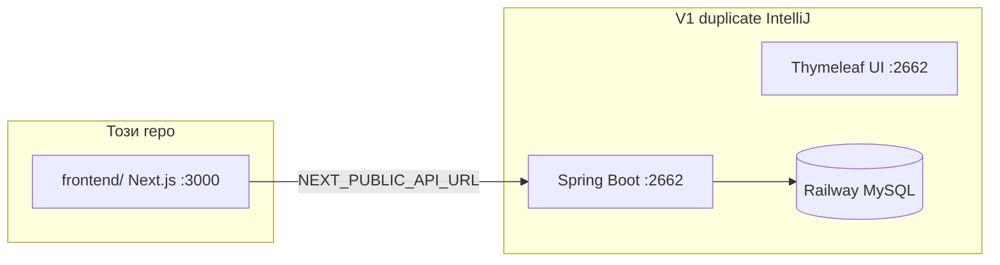
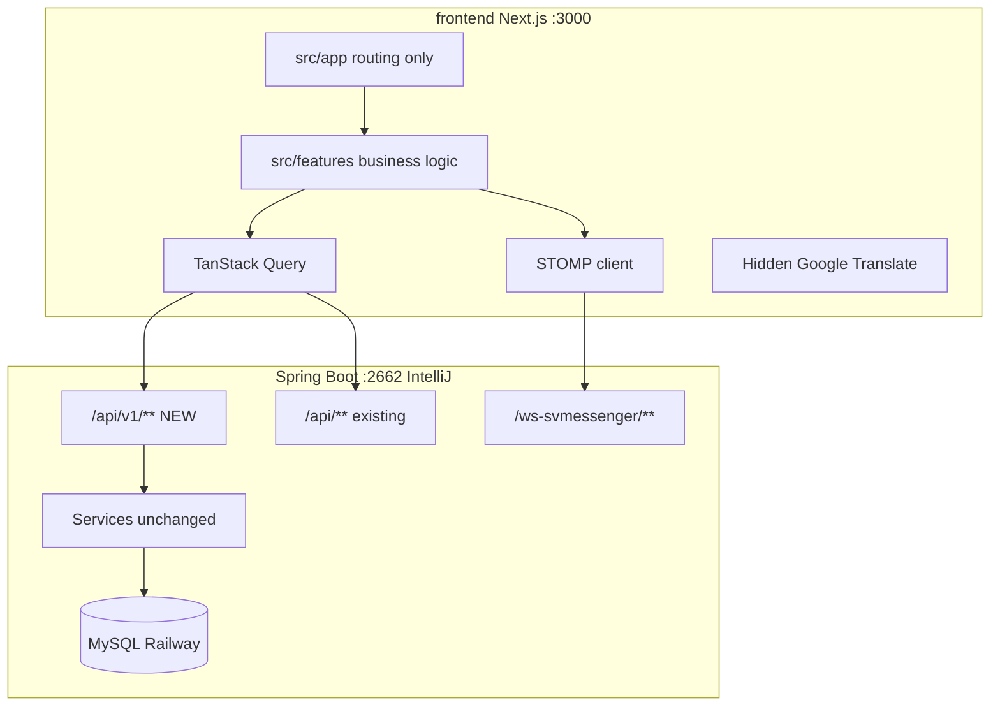
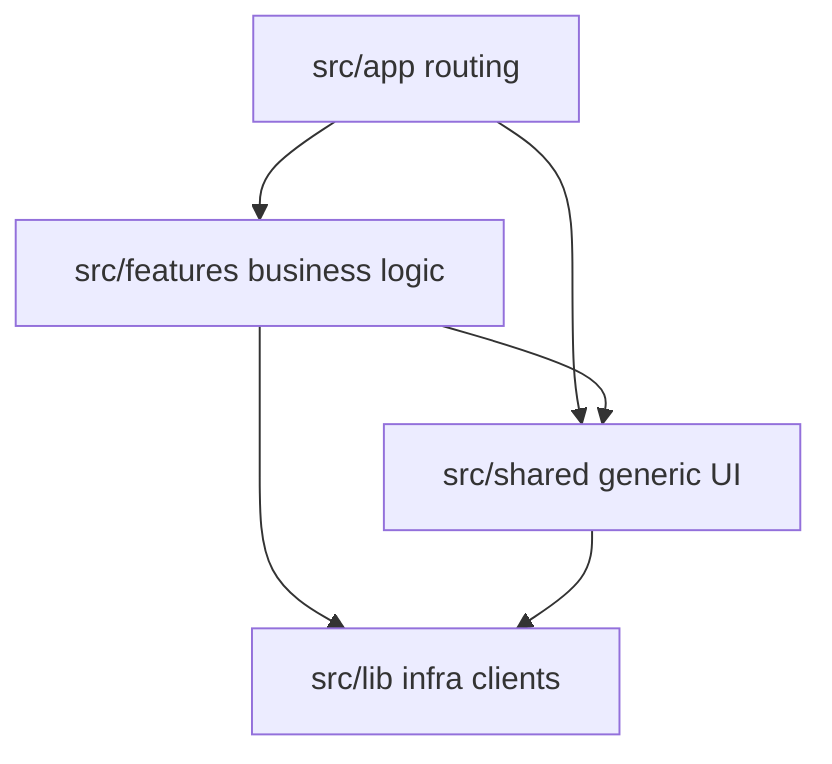

# Modern Frontend Migration — SmolyanVote (Plan v2)

> Roadmap за **изцяло нов frontend** (React 19 + Next.js 15 + Tailwind CSS + TypeScript),
> комуникиращ с **съществуващия Spring Boot backend** без rewrite на Java business logic.
>
> Целият нов UI живее в **`frontend/`** в главната директория на repo-то.

**Свързани документи:**
- [`DESIGN_BRIEF.md`](DESIGN_BRIEF.md) — canonical design tokens & UI patterns (v1 audit → Next.js)
- [`FULL_STACK_APP_REDESIGN_PLAN.md`](FULL_STACK_APP_REDESIGN_PLAN.md) — **не е избран path**; reference за domain ideas

---

## Избран path

| Path | Статус |
|------|--------|
| **Този документ** (Next.js + Java) | **Primary** — пълна замяна на frontend, Java backend без rewrite |
| Full-stack redesign (NestJS + Supabase) | Archive/reference only |
| Thymeleaf UI | Постепенно заменя се (Strangler Fig); v1 се пуска от **дубликат в IntelliJ** |

**Reuse от redesign plan (без Supabase/NestJS):** DESIGN_BRIEF tokens, multilingual 3-layer strategy, vote integrity patterns, realtime fallback ladder (адаптиран за STOMP/Java).

---

## Цел

| Deliverable | Локация | Описание |
|-------------|---------|----------|
| Този документ | `MODERN_FRONTEND_PLAN.md` | Roadmap, architecture, API contract, фази |
| Next.js app | `frontend/` | Feature-based `src/`, design system, API client, i18n |
| Java промени | v1 duplicate (IntelliJ) | CORS + `/api/v1/*` endpoints |

**Принцип:** Strangler Fig — постепенна замяна на Thymeleaf UI, backend services остават.

**Visual continuity:** UI tokens от [`DESIGN_BRIEF.md`](DESIGN_BRIEF.md) — green civic identity, glass navbar, photography hero.

**Dev URLs (фиксирани):**
- **Нов frontend:** `http://localhost:3000` (`npm run dev`)
- **Java backend + v1 UI:** `http://localhost:2662` (IntelliJ duplicate)

---

## Repository layout & dev workflow



**Правила:**
- В **този repo** живее **само** `frontend/` — **без** `gradlew bootRun` тук.
- V1 Java + Thymeleaf се стартират от **дубликат на проекта в IntelliJ** на `http://localhost:2662`.
- `.env.local`: `NEXT_PUBLIC_API_URL=http://localhost:2662`
- CORS в Java (IntelliJ duplicate): allowlist `http://localhost:3000` и `http://127.0.0.1:3000`

### Сравнение old vs new UI

| Tab | URL | Auth |
|-----|-----|------|
| Нов Next.js | `http://localhost:3000` | JWT (`/api/mobile/auth/*`) |
| Стар Thymeleaf | `http://localhost:2662` | Session cookies |

Login в един tab **не** логва автоматично в другия. За UI comparison: public pages или login и в двата.

---

## System architecture



**Auth:** JWT access + refresh от `MobileAuthController`.

**Vote writes:** винаги REST (`POST /api/v1/votes`) — никога през WebSocket.

---

## Tech Stack (`frontend/`)

| Слой | Технология |
|------|------------|
| Framework | Next.js 15 (App Router, `src/` directory) |
| UI | React 19 + TypeScript strict |
| Styling | Tailwind CSS v4 |
| Components | shadcn/ui + Radix UI в `src/shared/ui/` |
| Animations | Framer Motion |
| Data fetching | TanStack Query v5 |
| Forms | React Hook Form + Zod |
| HTTP | `src/lib/api/client.ts` — fetch wrapper, typed errors |
| Auth | JWT (reuse mobile flow) |
| Real-time | @stomp/stompjs + sockjs |
| Themes | Light default per DESIGN_BRIEF; dark optional (feature flag) |
| Web i18n Layer 1 | Hidden Google Website Translator |
| App i18n Layer 2 | Static locale TS files |
| Lint enforcement | eslint-plugin-boundaries |
| Tests | Vitest (colocated) + Playwright E2E |

---

## Folder structure

```
frontend/
├── src/
│   ├── app/                              # Next.js App Router — САМО routing, нула логика
│   │   ├── layout.tsx                    # Root providers wiring (тънък)
│   │   ├── page.tsx                      # Home — composition само
│   │   ├── globals.css
│   │   ├── (public)/
│   │   │   ├── events/
│   │   │   │   ├── page.tsx
│   │   │   │   └── [id]/page.tsx
│   │   │   ├── referendums/[id]/page.tsx
│   │   │   └── signals/page.tsx
│   │   ├── (auth)/
│   │   │   ├── login/page.tsx
│   │   │   └── register/page.tsx
│   │   ├── (protected)/
│   │   │   ├── dashboard/page.tsx
│   │   │   └── profile/page.tsx
│   │   └── api/                          # Route handlers (BFF proxy), ако нужно
│   │
│   ├── features/                         # Feature-based ядро — единствен слой с бизнес логика
│   │   ├── shell/                        # Navbar, Footer, Hero, AppPromoCard (DESIGN_BRIEF)
│   │   │   ├── components/
│   │   │   ├── index.ts
│   │   │   └── ...
│   │   ├── voting/
│   │   │   ├── components/
│   │   │   │   ├── VoteWidget.tsx
│   │   │   │   ├── VoteResults.tsx
│   │   │   │   └── VoteWidget.test.tsx
│   │   │   ├── hooks/
│   │   │   │   ├── useCastVote.ts
│   │   │   │   └── useLiveResults.ts
│   │   │   ├── api/
│   │   │   │   └── voting.api.ts
│   │   │   ├── types.ts
│   │   │   └── index.ts
│   │   ├── events/
│   │   ├── referendums/
│   │   ├── signals/
│   │   ├── auth/
│   │   ├── comments/
│   │   ├── messenger/
│   │   ├── podcast/                      # Phase 3–4
│   │   ├── publications/
│   │   └── admin/
│   │
│   ├── shared/                           # Кросфийчър, БЕЗ бизнес логика
│   │   ├── ui/                           # shadcn: Button, Card, Dialog
│   │   ├── hooks/                        # useDebounce, useMediaQuery
│   │   ├── lib/                          # форматиране, дати
│   │   └── types/
│   │
│   ├── lib/                              # Инфраструктурни клиенти
│   │   ├── api/
│   │   │   └── client.ts
│   │   ├── i18n/                         # Layer 2 static locales
│   │   ├── i18n-web-translate/           # Layer 1 hidden Google Translate
│   │   └── realtime/
│   │       └── stompClient.ts
│   │
│   ├── providers/
│   │   ├── QueryProvider.tsx
│   │   └── AuthProvider.tsx
│   │
│   ├── config/
│   │   ├── design-tokens.ts              # from DESIGN_BRIEF §13
│   │   └── env.ts                        # Zod-validated env vars
│   │
│   └── types/
│       └── api.ts
│
├── tests/
│   └── e2e/                              # Playwright
├── .eslintrc.cjs
├── tsconfig.json                         # paths: @/* → src/*
├── next.config.ts
├── package.json
└── .env.local.example
```

### Layer dependencies



---

## Frontend architecture rules (enforced)

### Железни правила

1. **Barrel exports:** всеки feature общува навън **само** през `features/*/index.ts`

```typescript
// ❌ забранено извън модула
import { VoteWidget } from '@/features/voting/components/VoteWidget';

// ✅ единствен правилен път
import { VoteWidget } from '@/features/voting';
```

2. **`features/*` никога не import-ва от друг `features/*` директно** — composition в `app/` или през `shared/`
3. **`app/` pages:** max **~30–40 реда** — само import + layout composition. Без `useState`/fetch в `page.tsx`
4. **`shared/` не познава domain** — `shared/ui/Button.tsx` без „vote“/„referendum“. Business UI → `features/`

### ESLint boundaries (CI gate)

```bash
npm install --save-dev eslint-plugin-boundaries
```

```javascript
// frontend/.eslintrc.cjs
module.exports = {
  plugins: ['boundaries'],
  settings: {
    'boundaries/elements': [
      { type: 'app', pattern: 'src/app/*' },
      { type: 'feature', pattern: 'src/features/*', capture: ['featureName'] },
      { type: 'shared', pattern: 'src/shared/*' },
      { type: 'lib', pattern: 'src/lib/*' },
    ],
  },
  rules: {
    'boundaries/element-types': ['error', {
      default: 'disallow',
      rules: [
        { from: 'app', allow: ['feature', 'shared', 'lib'] },
        { from: 'feature', allow: ['shared', 'lib'] },
        { from: 'shared', allow: ['lib'] },
        { from: 'lib', allow: [] },
      ],
    }],
  },
};
```

**dependency-cruiser** (periodic audit):

```bash
npx depcruise src --include-only "^src" --output-type dot | dot -T svg > dependency-graph.svg
```

### Naming conventions

| Тип | Convention | Пример |
|-----|------------|--------|
| Компоненти | PascalCase файл = export | `VoteWidget.tsx` |
| Hooks | `use` + camelCase | `useCastVote.ts` |
| API wrappers | camelCase + `.api.ts` | `voting.api.ts` |
| Route segments | kebab-case | `app/multi-polls/` |
| Types | `types.ts` per feature, PascalCase interfaces | `VoteRequest` |
| Тестове | colocated `.test.tsx` | `VoteWidget.test.tsx` |

### Anti-patterns (забранени)

- `utils.ts` с 40 несвързани функции
- flat `components/` с всичко разбъркано
- God hook `useApp()` с 15 несвързани return values
- Props drilling през 5 нива — state в feature Context/Zustand

---

## Design System

> **Canonical source:** [`DESIGN_BRIEF.md`](DESIGN_BRIEF.md). При conflict DESIGN_BRIEF печели.

| Element | Canonical value |
|---------|-----------------|
| Primary | `#19861c` |
| Accent | `#48a24c` |
| Gradient | `linear-gradient(135deg, #19861c, #48a24c)` |
| Text primary | `#2C3E50` |
| Fonts | Inter, Manrope, Source Sans 3, IBM Plex Sans |
| Navbar | Glass + underline hover, icon+label |
| Hero | Photography + glass CTAs |
| Theme | Light-first; dark optional (feature flag) |
| Gold | Messenger only |

**Export:** `src/config/design-tokens.ts` (from DESIGN_BRIEF §13)

**Shell components:** `features/shell/` — Navbar, Footer, Hero, AppPromoCard

---

## Multilingual Strategy (mandatory)

| Layer | Scope | Engine | Location |
|-------|-------|--------|----------|
| **1** | Web UGC HTML | Hidden Google Translate | `src/lib/i18n-web-translate/` |
| **2** | App shell labels | Static locales | `src/lib/i18n/` |
| **3** | Messenger messages | Gemini via Java API | `TranslationController.java` |

**Languages:** `bg`, `en`, `el`, `tr`, `ru`, `de`, `fr`, `es`, `iw`, `zh-CN`

**v1 reference:** `navbar.js`, `navbar.css`, `TranslationController.java`

**Do NOT:** show Google toolbar; replace Layer 1 with next-intl only for UGC

| Phase | Work |
|-------|------|
| 0 | LanguageSwitcher + GoogleTranslateProvider in layout |
| 1 | Layer 1 on all public SSR pages |
| 2 | Layer 2 auth shell (10 languages) |
| 3 | Layer 3 in messenger chat |

---

## Realtime & Live Updates (Java-adapted)

| Feature | Technology |
|---------|------------|
| SVMessenger | STOMP + SockJS `/ws-svmessenger/**` |
| Notifications | WebSocket |
| Live vote results | SSE/poll fallback |

| Tier | Trigger | Behavior |
|------|---------|----------|
| **0** | STOMP OK | Chat, typing, notifications |
| **1** | WS degraded | Vote counts → SSE or 5s poll |
| **2** | STOMP down > 2 min | Chat REST poll + degraded banner |
| **3** | Any | Vote writes **always REST** |

**Java (Phase 3):** `GET /api/v1/events/{id}/results`, optional `.../results/stream`

**Frontend:** `features/voting/hooks/useLiveResults.ts`

---

## Vote Integrity

**DB constraints (source of truth):** `UNIQUE(user_id, event_id)` on vote entities

**Frontend flow:**
1. `Idempotency-Key` (UUID) per attempt
2. `POST /api/v1/votes`
3. Handle `409 VOTE_ALREADY_CAST`
4. No double-submit without server ack
5. Live results via read path only

**Integration test:** 10 parallel votes → exactly 1 success

---

## npm scripts & minimal CI (Phase 0)

```json
{
  "scripts": {
    "dev": "next dev",
    "build": "next build",
    "lint": "eslint src --ext .ts,.tsx",
    "typecheck": "tsc --noEmit",
    "test": "vitest",
    "test:e2e": "playwright test",
    "depcruise": "depcruise src --include-only \"^src\""
  }
}
```

**GitHub Actions (frontend/ only):** lint + typecheck + boundaries on every PR

---

## Фаза 0 — Foundation

```bash
cd frontend
npx create-next-app@latest . --typescript --tailwind --app --eslint --src-dir
npm install @tanstack/react-query zod react-hook-form framer-motion clsx tailwind-merge @stomp/stompjs sockjs-client
npm install --save-dev eslint-plugin-boundaries dependency-cruiser vitest @testing-library/react @playwright/test
```

- shadcn/ui in `src/shared/ui/`
- `src/config/env.ts` — Zod: `NEXT_PUBLIC_API_URL` default `http://localhost:2662`
- `src/config/design-tokens.ts` from DESIGN_BRIEF
- `features/shell/` — Navbar, Footer, Hero, AppPromoCard
- ESLint boundaries configured
- `src/lib/api/client.ts` — JWT refresh, Idempotency-Key
- Home `src/app/page.tsx` — composition only (<40 lines)
- **`npm run dev` → `http://localhost:3000`**

**next.config.ts rewrites** (optional; or direct API URL):

```typescript
async rewrites() {
  return [
    { source: '/api/:path*', destination: 'http://localhost:2662/api/:path*' },
    { source: '/ws-svmessenger/:path*', destination: 'http://localhost:2662/ws-svmessenger/:path*' },
  ];
}
```

**Java (IntelliJ duplicate):** CORS `:3000` + `ApiV1EventsController` (`/api/v1/stats/home`, `/events`, `/events/{id}`)

---

## API Inventory

### Existing

| Endpoint | Controller | Feature module |
|----------|------------|----------------|
| `/api/mobile/auth/*` | MobileAuthController | `features/auth/` |
| `/api/comments/**` | CommentsController | `features/comments/` |
| `/api/notifications/**` | NotificationController | `features/shell/` or notifications |
| `/api/svmessenger/**` | SVMessengerController | `features/messenger/` |
| `/api/svmessenger/messages/{id}/translate` | TranslationController | Layer 3 |
| `/api/follow/**` | UserFollowController | `features/auth/` |
| `/api/podcast/episodes` | PodcastController | `features/podcast/` |
| `/admin/api/**` | AdminController | `features/admin/` |

### New `/api/v1/`

| Method | Path | Phase |
|--------|------|-------|
| GET | `/api/v1/stats/home` | 0 |
| GET | `/api/v1/events` | 0 |
| GET | `/api/v1/events/{id}` | 0 |
| GET | `/api/v1/referendums/{id}` | 1 |
| GET | `/api/v1/multipolls/{id}` | 1 |
| GET | `/api/v1/events/{id}/results` | 3 |
| GET | `/api/v1/events/{id}/results/stream` | 3 |
| POST | `/api/v1/votes` | 3 |

---

## Migration Phases

### Phase 0 — Foundation (2 седмици)

- [ ] `frontend/src/` structure per plan
- [ ] ESLint boundaries + tsconfig paths
- [ ] design-tokens, shell feature, home page
- [ ] i18n-web-translate + LanguageSwitcher
- [ ] API client + providers
- [ ] `localhost:3000` verified
- [ ] Java duplicate: CORS + ApiV1EventsController

### Phase 1 — Public pages (2–3 седмици)

- [ ] `features/events/`, `referendums/`, route groups
- [ ] SEO + Layer 1 Google Translate
- [ ] Event cards (DESIGN_BRIEF §10.3)

### Phase 2 — Auth & Profile (2 седмици)

- [ ] `features/auth/` — login, register, OAuth
- [ ] Layer 2 i18n (10 languages)

### Phase 3 — Interactive (3–4 седмици)

- [ ] `features/voting/` — VoteWidget, useCastVote, useLiveResults
- [ ] `features/messenger/` — merge `svmessenger-frontend/`, Layer 3 translate
- [ ] `features/admin/`, create event forms
- [ ] Java: ApiV1VoteController, results endpoints
- [ ] Concurrent vote test

### Phase 4 — Cutover & Hardening (2 седмици)

- [ ] k6 REST + WebSocket load tests
- [ ] Tier 1 SSE/poll fallback verified
- [ ] Production deploy (Next → Vercel/CF, API → DigitalOcean Java)
- [ ] Thymeleaf removal on v1 duplicate when ready

---

## Testing Strategy

| Layer | Tool | Location |
|-------|------|----------|
| Unit | Vitest + Testing Library | colocated `features/**/*.test.tsx` |
| E2E | Playwright | `tests/e2e/` |
| Load REST | k6 | Phase 4 gate |
| Load WS | k6 + STOMP | Phase 4 gate |
| Vote concurrency | Integration | 10 parallel → 1 success |

---

## Java Backend Notes

| Concern | Recommendation |
|---------|----------------|
| DB pool | Tune HikariCP; load test before referendum |
| Rate limit | bucket4j + Cloudflare WAF |
| WebSocket | Monitor STOMP sessions; sticky sessions if scale |
| Idempotency | `Idempotency-Key` + DB UNIQUE |

---

## Dev workflow

```powershell
# IntelliJ duplicate — backend + v1 UI
# gradlew bootRun → http://localhost:2662

# Този repo — frontend only
cd E:\MyProjectsJAVA\SmolyanVote\smolyanVote\frontend
npm run dev
# → http://localhost:3000
```

---

## `.gitignore` additions

```
frontend/node_modules/
frontend/.next/
frontend/.env.local
```

---

## Validation checklist (Phase 0)

- [ ] `MODERN_FRONTEND_PLAN.md` v2 в project root
- [ ] `frontend/` на **`http://localhost:3000`**
- [ ] ESLint boundaries pass
- [ ] Shell: Navbar, Hero, Footer, AppPromoCard (DESIGN_BRIEF)
- [ ] LanguageSwitcher + hidden Google Translate
- [ ] API client → IntelliJ backend `:2662`
- [ ] `GET /api/v1/stats/home` JSON OK

---

## Risk Register

| Risk | Impact | Mitigation |
|------|--------|------------|
| Cross-feature spaghetti | High | eslint-plugin-boundaries in CI |
| WS peak load | **High** | SSE/poll fallback; k6 before launch |
| HikariCP exhaustion | **High** | Pool tuning + load test |
| Google Translate break | Medium | Port v1 cookie/CSS exactly |
| Separate auth sessions | Low | Document comparison workflow |
| SVMessenger duplication | Medium | Merge to `features/messenger/` Phase 3 |

---

## Implementation todos

1. [ ] Scaffold `frontend/` with `--src-dir`
2. [ ] ESLint boundaries + tsconfig paths
3. [ ] `config/design-tokens.ts` + shell feature
4. [ ] i18n Layer 1 + 2 scaffold
5. [ ] API client + providers
6. [ ] Home page (`app/page.tsx` <40 lines)
7. [ ] Java duplicate: CORS + ApiV1EventsController
8. [ ] Minimal CI (lint + typecheck)
9. [ ] Phases 1–4
10. [ ] Load tests + cutover (Phase 4)

---

## Out of scope

- **Virtual Mayor** / `/api/virtualmajor/**` — deprecated, no migration, no `features/virtual-mayor/`
- Backend rewrite (NestJS / Supabase) — see FULL_STACK_APP_REDESIGN_PLAN (not chosen)
- DB schema changes
- Mobile app rewrite (SVMessengerMobile stays)
- `gradlew bootRun` in this repo (backend in IntelliJ duplicate only)

---

*Document version: 2.0 — Modern Frontend Plan (src/ feature architecture, ESLint boundaries, DESIGN_BRIEF, i18n 3-layer, STOMP fallback, vote integrity, Virtual Mayor out)*
