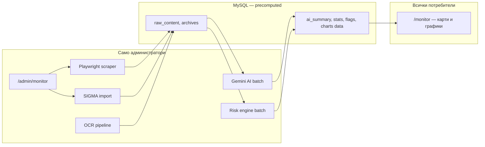
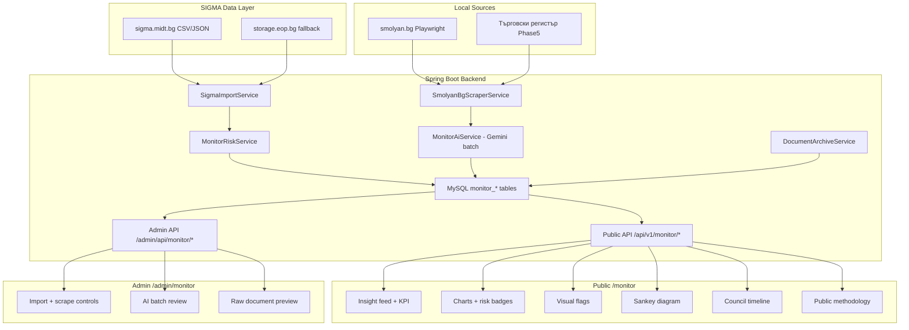

# Граждански монитор (`/monitor`) — План за имплементация

## Цел

SmolyanVote „Граждански монитор“ е **локален инструмент за прозрачност**, фокусиран **изключително върху Община Смолян и област Смолян**. Не е национален портал — показва само данни, свързани с региона.

Автоматично извлича, систематизира и представя в разбираем вид:

- обществени поръчки и договори на общините в област Смолян (от SIGMA/EOP)
- решения, протоколи и дневен ред на Общинския съвет на Смолян (от smolyan.bg)
- обществени обсъждания на община Смолян

Използва **backend pipeline** (AI, scraping, SIGMA) за събиране и анализ — **само за администратори**. За потребителите се показва **готов, перфектно структуриран изход** — карти, графики, KPI-та, без сурови текстове и технически шум.

**Извън обхват за v1 (бъдещи версии):** абонаменти/известия по тема, генератор на ZDOI заявления.

---

## Принцип: Admin pipeline → Public polish



| Слой | Кой го вижда | Какво съдържа |
|---|---|---|
| **Ingestion** | Admin | SIGMA import, scraper, OCR, cron статус, грешки, логове |
| **AI / Analysis** | Admin | Gemini batch, re-process, quality review, raw text preview |
| **Public API** | Всички | Само `MonitorPublicDTO` — резюмета, числа, badges, chart series |
| **Public UI** | Всички | KPI + карти + графики — **без** raw PDF/HTML, **без** AI chat |

**Правило:** Public API **никога** не връща `rawContent`, scraper logs, или admin-only полета. Потребителят вижда max **2–3 изречения** резюме + визуални данни + линк „Виж оригинала".

---

## Име и брандинг

| Елемент | Стойност |
|---|---|
| **Име в навигацията** | Монитор (или „Граждански монитор" на desktop) |
| **Заглавие на страницата (H1)** | Граждански монитор |
| **Подзаглавие** | Прозрачност за Смолян и региона |
| **URL route** | `/monitor` |
| **Metadata title** | SmolyanVote — Граждански монитор |
| **Metadata description** | Поръчки, решения и разходи на община Смолян — структурирани, проверими, на прост език. |
| **Feature module** | `frontend/src/features/monitor/` |
| **API prefix** | `/api/v1/monitor/*` |

### Навигация — mega-menu (като „Гласувай")

По същия pattern като [`VoteNavMenu.tsx`](frontend/src/features/shell/components/VoteNavMenu.tsx):

- Нов компонент **`MonitorNavMenu.tsx`** в `frontend/src/features/shell/components/`
- В [`navItems.ts`](frontend/src/features/shell/data/navItems.ts) — нов item `{ key: "monitor", href: "/monitor", icon: "bi-shield-check" }`
- В [`Navbar.tsx`](frontend/src/features/shell/components/Navbar.tsx) — `if (item.key === "monitor") return <MonitorNavMenu ... />` (desktop + mobile, както при vote)
- i18n ключ `nav.monitor` → „Граждански монитор" (bg), „Citizen Monitor" (en), и т.н.
- Export от [`shell/index.ts`](frontend/src/features/shell/index.ts)

**Структура на dropdown-а (2 колони + CTA):**

| Колона 1 — „Документи" | Колона 2 — „Поръчки и анализ" |
|---|---|
| Всичко → `/monitor` | Поръчки → `/monitor/procurement` |
| Общински съвет → `/monitor/council` | Аномалии → `/monitor/anomalies` |
| Обсъждания → `/monitor/consultations` | Парични потоци → `/monitor/flows` |
| Срокове → `/monitor/deadlines` | Регион → `/monitor/region` |

**CTA бутон в долната част:** „Отвори монитора" → `/monitor` (аналог на „Разгледай всички" при Гласувай)

**UX детайли (1:1 с VoteNavMenu):**
- Glass dropdown, framer-motion animate, click-outside + Escape затваряне
- `MenuRow` с icon + title + description за всяка секция
- Mobile: full-width trigger, `onNavigate` затваря mobile drawer
- Active state: `pathname.startsWith("/monitor")` → highlight на nav бутона

**Routes (отделни страници или tab deep links):**

```
/monitor                    — начало / feed (Всичко)
/monitor/procurement        — поръчки и договори
/monitor/anomalies          — flagged contracts
/monitor/flows              — Sankey парични потоци
/monitor/council            — решения и протоколи ОбС
/monitor/consultations      — обществени обсъждания
/monitor/deadlines          — календар със срокове
/monitor/region             — сравнение между общините в областта
/monitor/methodology        — публична методология
/monitor/contract/[id]      — детайл на договор
/monitor/document/[id]      — детайл на документ
```

---

## Географски обхват (задължително ограничение)

Всички данни, анализи, сравнения и UI са **само за област Смолян**. Няма национални класации, няма данни от други области.

### Основен фокус — Община Смолян

- ЕИК: `000615118`
- SIGMA: `sigma.midt.bg/authorities/000615118`
- ЦАИС ЕОП buyer: `app.eop.bg/buyer/14860`
- Документи: `smolyan.bg` (решения, протоколи, обсъждания)

### Регионален контекст — останалите общини в област Смолян

За сравнения и контекст (не като основен feed), включваме само:

| Община | NUTS3 (SIGMA) |
|---|---|
| Смолян | BG424 |
| Девин | — |
| Златоград | — |
| Мадан | — |
| Чепеларе | — |
| Рудозем | — |
| Неделино | — |
| Баните | — |

> При import от SIGMA филтрираме по `authority_eik` / `authorities.region = 'Смолян'` и whitelist на ЕИК-ове на общините в областта. Компаниите се показват **само ако** имат договор с възложител от региона.

### Какво е извън обхват

- Поръчки на държавни институции извън региона (министерства, агенции, други общини)
- Национални класации „топ фирми в България"
- CPV медиани и peer comparison извън област Смолян
- Scraping на сайтове на общини извън област Смолян
- EU/национални dashboard-и без пряка връзка със Смолян

### Правило за всички слоеве

```
IF authority NOT IN oblast_smolyan_municipalities
   AND contract NOT linked to smolyan_region_project
THEN exclude from ingest, API, UI, AI context
```

---

## Визия

1. **Не преизобретява колелото** — ползва SIGMA/EOP, но **само за област Смолян**
2. **Добавя това, което SIGMA няма локално** — решения на ОбС Смолян, обсъждания, връзка със Сигнали
3. **Разкрива регионални схеми** — risk scoring, връзки, сравнения между общините в областта
4. **Говори на прост език** — AI резюмета се генерират в backend; потребителят вижда **готов insight**, не инструмент

---

## UX принципи (задължителни за public UI)

Цел: потребителят за **10 секунди** да разбере „какво става с парите и решенията в Смолян" — без да се губи в бюрократски текст.

### Какво показваме

- **KPI лента** на всяка страница — 3–5 числа с икона (общо похарчено, активни поръчки, flagged, нови решения)
- **Insight cards** — заглавие + 1 ред контекст + сума/дата/risk badge + „Виж детайли"
- **Графики първо** — bar, line, Sankey, donut; таблици само при drill-down
- **Risk badges** с tooltip „Какво значи?" — **1 изречение**, не есета
- **„Тази седмица"** — max 5 карти, AI-ranked по impact
- **Progressive disclosure** — card → detail sheet → „Пълен оригинал" (external link)
- **Data freshness** — „Данни актуални до 29.07.2026" (от `data_freshness`)
- **Visual hierarchy** — сума и risk score най-големи; категория като цветен chip

### Какво НЕ показваме на потребители

- Суров HTML/PDF текст (освен в admin)
- Gemini chat / AI инструменти
- Scraper/SIGMA статус, cron logs, ETL грешки
- Дълги AI резюмета (max 280 chars на card)
- Таблици с 50 колони без филтър
- Технически термини без tooltip (CPV, HHI → човешки етикет)

### Design reference

- KPI strip като `TotalsStrip` в SIGMA
- Card density като `SignalCard` / `EventCard` в SmolyanVote
- Charts: Recharts или подобна библиотека вече в stack-а
- Mobile: една колона, swipeable cards, bottom sheet за детайл

---

## 1. Източници на данни

### 1.1 Обществени поръчки (без scraping)

- **Sigma** — import само за възложители от **област Смолян** (whitelist на ЕИК-ове)
- Основен профил: `sigma.midt.bg/authorities/000615118` (Община Смолян)
- **ЦАИС ЕОП** (`storage.eop.bg`) — fallback, със същия регионален филтър
- **app.eop.bg/buyer/14860** — профил на Община Смолян

**Import rule:** `SigmaImportService` приема само договори, където `authority_eik` е в списъка на общините от област Смолян. Компаниите се materialize-ват само ако участват в поне един такъв договор.

### 1.2 Общински съвет (Playwright scraper на smolyan.bg)

- Решения: `smolyan.bg/bg/menu/sl/10`
- Протоколи: `smolyan.bg/bg/menu/sl/64`
- Дневен ред: `smolyan.bg/bg/menu/sl/8`
- Общо съдържание: `smolyan.bg/bg/menu/content/{ID}`

### 1.3 Обществени обсъждания

- `smolyan.bg/bg/menu/fl/33`

### 1.4 Бъдещи източници (Phase 5)

- Търговски регистър (`portal.registryagency.bg`) — собственици, УБО
- Декларации по ЗПКОНПИ — кръстосана проверка със съветници
- Бюджет на общината, ЕС фондове (ISUN)

---

## 2. Какво вземаме от SIGMA Git (не дублираме)

Repo: [github.com/midt-bg/sigma](https://github.com/midt-bg/sigma) (MIT)

| SIGMA артефакт | Как го ползваме |
|---|---|
| CSV/JSON export | Import с whitelist `authority_eik IN (oblast_smolyan)` |
| `apps/web/app/lib/riskLogic.ts` | Портваме в Java `MonitorRiskService` |
| Anomaly rules (PR #239) | 3 price signals + risk score 0-100 |
| `competition.ts` | HHI, single bidder share — **само в рамките на региона** |
| `packages/config/src/index.ts` | CPV taxonomy, BG regions, procedure groups |
| `docs/core-scope.md` | Domain model, `amount_eur`, `value_flag` semantics |
| `scripts/normalize-raw.sql`, `eik-valid.fragment.sql` | Reference за EOP fallback ETL |
| UI patterns (Sankey, DataTable, methodology page) | ProcurementFlowsChart, MonitorMethodologyPage |

**Не копираме:** Cloudflare Workers/D1 stack, full national ETL pipeline.

**SIGMA roadmap (v2-v4) — ние покриваме локално:** council decisions, OCR на PDF, connections graph.

---

## 3. Архитектура



---

## 4. Backend

### 4.1 Data model

**Поръчки (от SIGMA schema):**

- `monitor_authorities` — само общини/звена от **област Смолян**
- `monitor_companies` — само фирми с договор към регионален възложител
- `monitor_contracts` — само регионални договори (+ `region_scope` enum: `SMOLYAN_CITY` | `OBLAST_SMOLYAN`)
- `monitor_amendments` — анекси (signing → current value history)
- `monitor_risk_scores` — precomputed CRI per entity

**Документи (от smolyan.bg):**

- `monitor_documents` — решения, протоколи, обсъждания
- `monitor_archives` — immutable snapshots (content hash + raw HTML/PDF)

**Критично правило от SIGMA:** сумиране само на `amount_eur IS NOT NULL`.

`MonitorDocumentEntity` полета: source, sourceUrl, sourceId, documentType, title, rawContent, aiSummary, aiCategory, impactScore, amount, companyName, companyEik, deadlineDate, publishedAt, fetchedAt, contentHash.

### 4.2 Risk engine (`MonitorRiskService`)

Порт от SIGMA `riskLogic.ts` + локални правила:

| Flag | Rule |
|---|---|
| Единствена оферта | `bids_received = 1` |
| Над прогнозата | signed ≥ +10% above estimate |
| Ръст чрез анекси | current ≥ +20% over signing |
| Далеч над типичното | ≥ 5× CPV median — **median от договори в област Смолян**, не национален |
| Раздробяване на поръчки | N contracts same company+CPV under threshold in 90 days — **само при община Смолян** |
| Повтарящ се победител | company wins >50% in sector — **само при регионални възложители** |
| Ново дружество, голяма поръчка | company age < 6 months + contract > 100k — **при регионален възложител** |
| Подписан след публикация | `date_flag = signed_after_publication` |

Risk score 0-100 per contract + CRI composite per company. Публична методология на `/monitor/methodology`.

### 4.3 Services

- `SigmaImportService` — fetch regional data from SIGMA, filter by oblast Smolyan EIK whitelist
- `SmolyanBgScraperService` — Playwright sidecar
- `MonitorRiskService` — risk flags + scoring
- `MonitorAiService` — Gemini summaries, categorization, impact score
- `DocumentArchiveService` — snapshots + diff detection
- `MonitorService` — feed, search, stats

### 4.4 Scheduled tasks

- `@Scheduled(cron = "0 0 4 * * *")` — Sigma import
- `@Scheduled(cron = "0 0 6 * * *")` — smolyan.bg scrape
- При нов/променен документ → AI processing + archive snapshot

### 4.5 REST API

**Public** (`/api/v1/monitor/*`) — read-only, sanitized DTOs:

- `GET /api/v1/monitor/overview` — KPI strip (totals, flagged count, last updated)
- `GET /api/v1/monitor/feed?page=&category=&type=` — insight cards (title, shortSummary, badges, amount)
- `GET /api/v1/monitor/search?q=&page=` — titles + snippets only
- `GET /api/v1/monitor/procurement/stats` — chart-ready series
- `GET /api/v1/monitor/procurement/competition`
- `GET /api/v1/monitor/procurement/regional-comparison` — chart data Смолян vs област
- `GET /api/v1/monitor/procurement/anomalies`
- `GET /api/v1/monitor/procurement/flows` — Sankey nodes/links
- `GET /api/v1/monitor/contract/{id}` — public detail (no rawContent)
- `GET /api/v1/monitor/company/{eik}`
- `GET /api/v1/monitor/document/{id}` — summary + metadata + sourceUrl
- `GET /api/v1/monitor/deadlines`
- `GET /api/v1/monitor/categories`
- `GET /api/v1/monitor/council/{name}`

**Admin** (`/admin/api/monitor/*`) — requires admin role:

- `GET /admin/api/monitor/ingestion/status` — last run, counts, errors
- `POST /admin/api/monitor/ingestion/trigger-sigma` — manual SIGMA import
- `POST /admin/api/monitor/ingestion/trigger-scrape` — manual smolyan.bg scrape
- `POST /admin/api/monitor/ai/reprocess/{documentId}` — re-run Gemini on document
- `GET /admin/api/monitor/documents/{id}/raw` — raw content + archive for review
- `GET /admin/api/monitor/logs` — ingestion/AI job logs

DTOs: `MonitorPublicDTO` (public), `MonitorAdminDTO` (admin). **Never expose rawContent in public DTO.**

### 4.6 Admin panel (`/admin` → tab „Монитор")

Разширяване на съществуващия admin feature ([`frontend/src/features/admin/`](frontend/src/features/admin/)):

- **Ingestion dashboard** — SIGMA last sync, scraper last run, documents added/changed
- **Trigger buttons** — ръчно пускане на import/scrape (admin only)
- **AI queue** — pending/processed/failed summaries, re-process button
- **Raw preview** — HTML/PDF archive за верификация преди публикуване на summary
- **Ingestion errors** — failed URLs, retry

---

- `scraper/index.js` — Playwright, rate limit 1 req/2s; **само admin trigger**, не public
- Docker service в `NewServerConfig/docker-compose.prod.yml`

---

## 5. Frontend — Public (`frontend/src/features/monitor/`)

### 5.1 UI секции (visual-first)

- **Hero + KPI strip** — 4 числа: похарчено YTD, активни поръчки, flagged, нови документи
- **Бързо търсене** — autocomplete по заглавие/фирма/улица
- **„Тази седмица"** — max 5 insight cards, визуално ranked
- **Табове:** Всичко | Поръчки | Аномалии | Потоци | Общински съвет | Обсъждания | Срокове | **Регион**
- **MonitorDocumentCard** — заглавие, **1 ред** резюме, chips (категория, risk, сума), дата; tap → detail sheet
- **ProcurementDashboard** — donut по CPV + bar top 10 companies + line monthly spend
- **MonitorAnomaliesTab** — cards sorted by risk score; червен/жълт/зелен indicator
- **RegionalComparisonTab** — grouped bar chart Смолян vs 7 общини
- **ProcurementFlowsChart** — интерактивен Sankey (hover = сума + брой)
- **Council timeline** — vertical timeline с икони, не списък от PDF заглавия
- **MonitorMethodologyPage** — кратко, с икони; формули в collapsible секции
- **Detail sheet** — structured facts grid + risk flags с tooltips + „Виж оригинала ↗"
- **Signals cross-link** — „12 сигнала за тази улица" badge на релевантни договори
- **Share cards** — OG image с ключови числа

**Няма в public UI:** Gemini chat, raw text viewer, admin controls.

### 5.2 Мобилна версия

Pattern като Signals: `useIsMobile()`, bottom tabs, bottom sheet за детайл.

### 5.3 Навигация

**Navbar mega-menu** — `MonitorNavMenu` (pattern от `VoteNavMenu`):
- Desktop: dropdown с 2 колони (Документи | Поръчки и анализ) + CTA
- Mobile: същият компонент в drawer-а
- Файлове: `MonitorNavMenu.tsx`, `navItems.ts`, `Navbar.tsx`, `locales.ts`

---

## 6. Допълнителни функции

### Парите като разказ (регионален фокус)

- Top 20 companies — **само с договори в област Смолян**, 5-year trend
- Regional comparison — Смолян vs останалите 7 общини в областта (цена/км, цена/CPV, single bidder %)
- „Къде отиват парите в Смолян" — spending by CPV category (**само община Смолян**)
- „Какво получихме" — contracts linked to Signals on same street/location in SmolyanVote

### Document integrity

- Immutable archive на всеки документ (SHA-256)
- Diff detection при промяна/изтриване от smolyan.bg
- OCR (Tesseract bg) за сканирани PDF-и
- Provenance: source URL + archive snapshot + fetch timestamp

### Legal & trust

- Всяко твърдение → линк към първоизточник
- Разграничение: факт vs AI интерпретация vs risk flag (не обвинение)
- Публична методология

---

## 7. AI Pipeline (Gemini) — Admin-only batch

AI **не е chat за потребители**. Работи като **нощен batch job** след ingestion:

1. Нов/променен документ → queue
2. Gemini генерира: `shortSummary` (max 280 chars), `category`, `impactScore`
3. Admin може да re-process от `/admin/monitor`
4. Public API връща само готовите полета

Prompt-и (backend only):

- **shortSummary** — „Обобщи в max 2 изречения на прост български за гражданин от Смолян: {rawContent}"
- **Category** — enum от списък
- **Impact Score** — 1-10

**Няма** public Gemini chat в v1–v4.

---

## 8. Docker / Deployment

- Scraper service в `docker-compose.prod.yml`
- Gemini API key вече конфигуриран
- Scraper health check в `post-deploy.sh`

---

## 9. Фази на имплементация

### Phase 1 — Foundation (4-6 weeks)

1. MySQL schema + `MonitorPublicDTO` / admin DTOs
2. SigmaImportService — regional EIK whitelist
3. MonitorRiskService — port riskLogic.ts
4. Public REST API (`/overview`, `/feed`, `/procurement/stats`)
5. **Public UI:** KPI strip + insight cards + procurement charts
6. Methodology page (collapsible, visual)
7. MonitorNavMenu + navbar integration
8. **Admin tab:** ingestion status + manual trigger

### Phase 2 — Local documents + AI (3-4 weeks)

9. Playwright sidecar (admin-triggered)
10. OCR pipeline (admin/backend)
11. Document archive + diff detection
12. Gemini batch summaries (admin review queue)
13. Council timeline in public UI
14. Full-text search (titles/snippets only in public)

### Phase 3 — Intelligence (3-4 weeks)

15. Anomaly cards with risk visualization
16. CRI composite risk per company (badge only in public)
17. Money flows Sankey
18. Regional comparison charts
19. Competition dashboard (HHI — regional)

### Phase 4 — Civic power (3-4 weeks)

20. Connections graph (visual, simplified for public)
21. Councilor profile cards (stats, not document dumps)
22. Signals cross-linking badges
23. Mobile layout polish

### Phase 5 — Deep data (ongoing)

27. Commercial Register — **само за фирми от регионални договори**
28. ZPKONPI — **само съветници/служители на община Смолян**
29. Budget vs execution — **само бюджет на община Смолян**
30. EU funds — **само проекти в област Смолян** (ISUN)

### Бъдещи версии (не в v1)

- Абонаменти/известия по тема (push, email)
- ZDOI генератор на заявления
- Public AI chat (ако някога — не е планирано)

---

## 11. Какво още добавихме (checklist)

- [x] Admin vs public separation (AI, scraper, SIGMA = admin only)
- [x] Public DTO без raw content
- [x] UX принципи: KPI, cards, charts, progressive disclosure
- [x] Admin panel tab за ingestion + AI review
- [x] `/monitor/overview` KPI endpoint
- [x] Max 280 chars summary на cards
- [x] Data freshness indicator
- [x] Risk tooltips (1 изречение)
- [x] Премахнат public Gemini chat
- [x] Council timeline вместо PDF list
- [x] Chart-ready API responses (не raw tables)
- [x] Code organization: feature-first, monitor subpackages, thin routes

---

## 10. Ключови файлове

**Backend:**
- `models/MonitorContractEntity.java`, `MonitorCompanyEntity.java`, `MonitorDocumentEntity.java`
- `services/monitor/SigmaImportService.java`
- `services/monitor/MonitorRiskService.java`
- `services/monitor/MonitorAiService.java`
- `services/monitor/DocumentArchiveService.java`
- `controllers/apiv1/MonitorController.java` — public read-only
- `controllers/AdminMonitorController.java` — admin ingestion/AI
- `scheduling/MonitorIngestionScheduler.java`

**Frontend public:**
- `features/monitor/` — full module
- `features/monitor/data/cpv-sectors.ts` (from SIGMA config)
- `features/monitor/components/MonitorKpiStrip.tsx`
- `features/monitor/components/MonitorInsightCard.tsx`
- `features/monitor/components/MonitorDetailSheet.tsx`
- `features/monitor/components/ProcurementFlowsChart.tsx`
- `features/monitor/components/MonitorAnomaliesTab.tsx`
- `features/monitor/components/MonitorMethodologyPage.tsx`
- `features/shell/components/MonitorNavMenu.tsx`
- `app/monitor/page.tsx` + sub-routes

**Frontend admin:**
- `features/admin/components/MonitorAdminPanel.tsx`
- `features/admin/api.ts` — monitor admin endpoints

**Infrastructure:**
- `scraper/` — Playwright sidecar
- `NewServerConfig/docker-compose.prod.yml`

---

## 12. Организация на кода (anti-spaghetti)

Цел: **целият Monitor код живее в ясно очертани модули** — нищо разхвърляно в root, signals, admin или generic services. Следваме conventions на `signals` и `admin`.

### Правило №1: Feature-first, thin routes

| Локация | Какво съдържа |
|---|---|
| `app/monitor/` | Само `page.tsx` + metadata (5–15 реда) |
| `features/monitor/` | Цялата public логика, UI, hooks, API |
| `features/admin/` | Само `MonitorAdminPanel` + admin API |
| `features/shell/` | Само `MonitorNavMenu` |
| `scraper/` | Playwright sidecar (отделен процес) |
| `models/monitor/`, `services/monitor/` | Backend vertical slice |

**Забранено:** business logic в `app/`, monitor types в `shared/`, monitor API извън `features/monitor/api.ts`.

### Frontend — `features/monitor/`

```
monitor/
├── index.ts                 # barrel export
├── api.ts                   # monitorApi + MONITOR_*_QUERY_KEY
├── types.ts
├── data/                    # static config (cpv, eiks, nav-sections)
├── lib/                     # formatAmount, riskLabels, chartColors
├── hooks/                   # useMonitorOverview, useMonitorFeed, ...
└── components/
    ├── pages/               # route shells (compose only)
    ├── layout/              # MonitorPageShell, SectionHeader
    ├── kpi/                 # MonitorKpiStrip
    ├── cards/               # InsightCard, ContractCard
    ├── charts/              # Flows, Regional, SpendByCategory
    ├── detail/              # DetailSheet, RiskBadge
    └── council/             # CouncilTimeline
```

**Import direction:** `pages/` → `cards/charts/hooks` → `api/types`. Обратните import-и и cross-import от `signals` — **забранени**.

**App route pattern:**
```tsx
// app/monitor/procurement/page.tsx — max ~15 реда
import { MonitorProcurementPage } from "@/features/monitor";
export default function Page() { return <MonitorProcurementPage />; }
```

### Backend — subpackage `monitor/`

```
models/monitor/           → entities + enums
repositories/monitor/     → JPA repos
services/monitor/
  ├── MonitorService.java           # public read facade
  ├── MonitorPublicMapper.java
  ├── ingestion/                    # SigmaImport, ScraperClient, Scheduler
  ├── analysis/                     # RiskService, AiService (Gemini batch)
  └── admin/                        # AdminService, ArchiveService
controllers/apiv1/MonitorController.java      # public
controllers/AdminMonitorController.java       # admin
viewsAndDTO/apiv1/monitor/                    # all DTOs here
```

**Правила:**
- Public controller → само `MonitorService` (read-only DTOs)
- Admin controller → ingestion/analysis/admin services
- `MonitorAiService` и scraper → **никога** от public controller
- Gemini HTTP client → отделен `MonitorGeminiClient` (не смесване с messenger)

### Scraper — `scraper/` (repo root, zero coupling)

Отделен Node процess. Java го вика via HTTP. Без imports от frontend/backend source.

### Naming conventions

| Layer | Pattern |
|---|---|
| Entity | `Monitor*Entity` |
| DTO | `Monitor*DTO` |
| Service | `Monitor*Service` |
| Component | `Monitor*` |
| Hook | `useMonitor*` |
| Query key | `MONITOR_*_QUERY_KEY` |

### Pre-merge checklist

- [ ] Няма monitor файлове извън monitor subpackages
- [ ] `app/monitor/**` pages under 20 реда
- [ ] Public API без `rawContent`
- [ ] Admin endpoints зад admin role
- [ ] `index.ts` export-ва controlled public surface
- [ ] Chart data от API, не duplicate logic в UI
